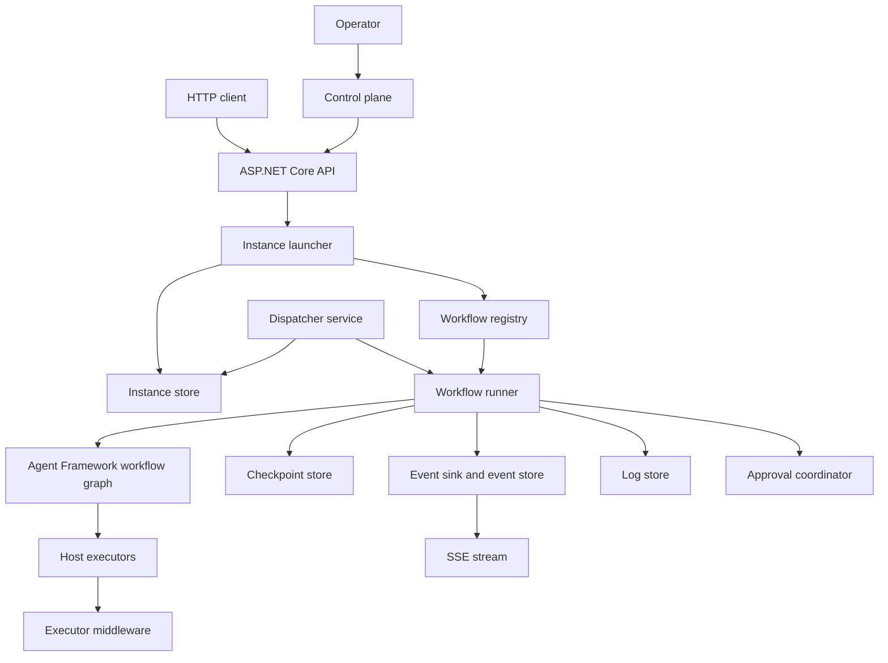
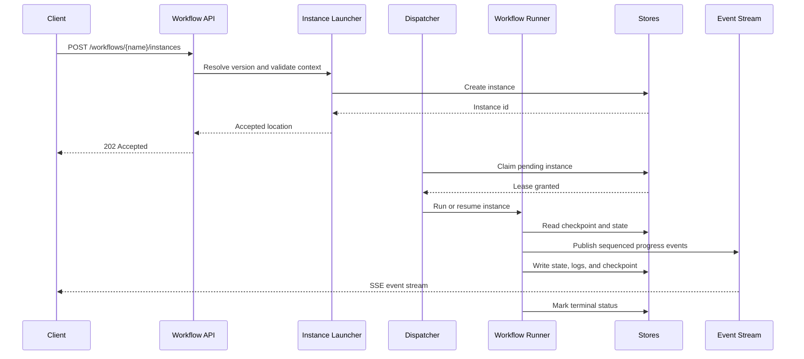
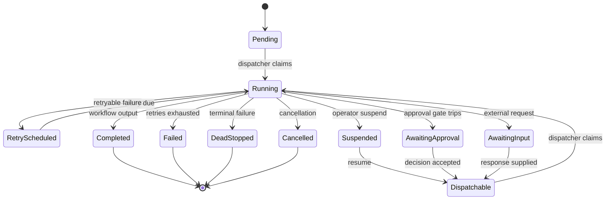
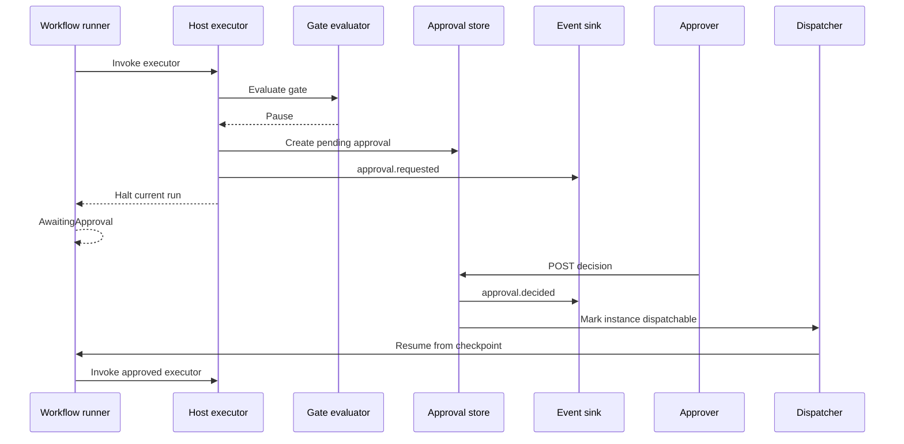
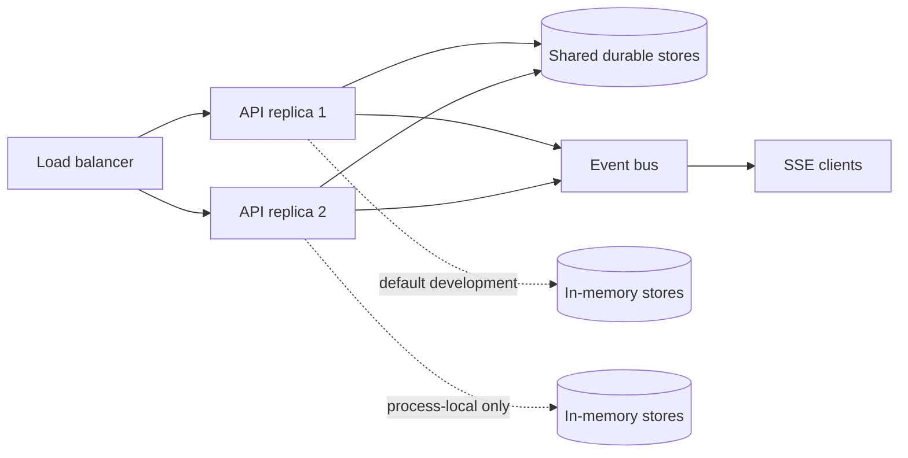
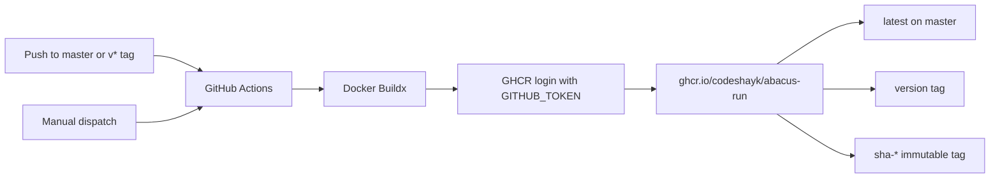

# Abacus Run Wiki

Abacus Run is a .NET 9 workflow runtime and HTTP host built on Microsoft Agent Framework workflows. It turns a graph-based workflow definition into a managed workflow instance with a lifecycle, ownership, retries, checkpoints, approvals, events, logs, and operator controls.

This page is the repository-level technical wiki. It documents the implementation in this repository. The product and technical design documents in this directory describe the broader target architecture; where the target and current implementation differ, this page calls out the difference.

## Contents

- [At a glance](#at-a-glance)
- [Current implementation status](#current-implementation-status)
- [Architecture](#architecture)
- [Project structure](#project-structure)
- [Getting started](#getting-started)
- [Authoring a workflow](#authoring-a-workflow)
- [Workflow audit records](#workflow-audit-records)
- [Registering workflows and middleware](#registering-workflows-and-middleware)
- [Instance lifecycle](#instance-lifecycle)
- [Retries and failure classification](#retries-and-failure-classification)
- [Checkpoints and resumption](#checkpoints-and-resumption)
- [Human approval gates](#human-approval-gates)
- [Tenant executor configuration](#tenant-executor-configuration)
- [Events, history, and SSE](#events-history-and-sse)
- [Event broker and event-driven workflows](#event-broker-and-event-driven-workflows)
- [HTTP API](#http-api)
- [Configuration](#configuration)
- [Security and data handling](#security-and-data-handling)
- [Operations](#operations)
- [Containers and GHCR](#containers-and-ghcr)
- [Testing](#testing)
- [Extension points](#extension-points)
- [Design constraints](#design-constraints)
- [Troubleshooting](#troubleshooting)
- [Related documents](#related-documents)

## At a glance

| Concern | Current behavior |
| --- | --- |
| Runtime | .NET 9 / ASP.NET Core minimal API |
| Workflow engine | `Microsoft.Agents.AI.Workflows` |
| Workflow registration | Dependency injection through `AddWorkflow<T>()` or `AddWorkflow(IWorkflowDefinition)` |
| Persistence | In-memory stores by default |
| Checkpoint cadence | Superstep by default; `None`, `SuperStep`, and `Manual` are supported |
| Ownership | Dispatcher and lease abstractions are used by the host; the default stores are process-local |
| Events | Sequenced per-instance event store plus optional event bus and SSE relay; nodes emit their own via `Runtime.Notify`, and a definition sets its emission policy |
| Event broker | Topic pub/sub for event-driven pipelines: workflows start on a trigger or park on a wait. Local in-process by default, Redis Streams for cross-service |
| Approvals | Durable approval contracts and in-memory coordinator/store, with decision and expiry handling |
| Middleware | Workflow-level and host-executor-level pipelines |
| Audit records | A workflow declares the shape of its own audit record; the runtime hands every node a recorder and stores entries generically |
| Library | `src/Abacus.Run` — headless framework: runtime, dispatch, executors, middleware, in-memory stores, HTTP API |
| Service host | `src/Abacus.Run.Service` — control-plane UI, SQL Server stores, Redis event bus, startup wiring |
| Container | Multi-stage .NET 9 image listening on port 8080 |
| Image publishing | GitHub Actions publishes `ghcr.io/codeshayk/abacus-run` |

## Current implementation status

The repository contains a working runtime, API host, control plane, built-in executors, middleware, persistence abstractions, and test suites. The default host wiring in `Program.cs` uses in-memory infrastructure:

- `InMemoryInstanceStore`
- `InMemoryEventStore`
- `InMemoryLogStore`
- `InMemoryApprovalStore`
- `InMemoryGatePolicyStore`
- `InMemoryAuditStore`
- `InMemoryAuditRecordStore`
- `InMemoryBlobStore`
- `OverflowCheckpointStore` over the blob abstraction
- `InMemoryEventBus`
- `InMemoryEventSubscriptionStore`
- `InProcessEventBroker`

The store interfaces are the substitution boundary for durable infrastructure. A production deployment must provide shared, durable implementations before relying on process loss recovery or multiple replicas.

The repository also contains `docs/PRD-Abacus-Run.md` and `docs/TDD-Abacus-Run.md`. Those documents describe the intended multi-replica SQL/blob/event-bus architecture and include design decisions that go beyond the current in-memory default.

## Architecture



### Request path

1. A caller posts a typed JSON context to `/workflows/{name}/instances`.
2. The launcher resolves the requested workflow version and validates the context against its CLR type.
3. The launcher creates an instance record and returns `202 Accepted` with the instance location.
4. The dispatcher claims a claimable instance and invokes `WorkflowRunner`.
5. The runner rebuilds the workflow graph from the pinned workflow definition and starts or resumes an Agent Framework streaming run.
6. Framework events are translated into sequenced `EventEnvelope` records.
7. The runner updates instance state, checkpoints, logs, approvals, and terminal outcome as the run progresses.
8. Clients poll the instance, read event history, or subscribe to its SSE stream.

### Start and execution sequence



### Ownership model

An instance is the unit of execution and is identified by a stable `InstanceId`. Its workflow name and version are recorded when it is created. A dispatcher should execute only instances it has successfully claimed. The instance store and lease implementation are responsible for preventing two host replicas from actively driving the same instance.

The default in-memory stores are suitable for development and tests. They do not provide cross-process coordination or durable recovery by themselves.

## Project structure

| Project | Responsibility |
| --- | --- |
| `src/Abacus.Run` | Headless framework: workflow contracts, runtime, dispatch, executors, middleware, in-memory store defaults, and the HTTP API endpoints |
| `src/Abacus.Run.Service` | Deployable host: control-plane UI, concrete persistence and event-bus integrations, service registration, and the workflow definitions this deployment runs |
| `tests/Abacus.Run.UnitTests` | Focused runtime and store tests; references the library only |
| `tests/Abacus.Run.IntegrationTests` | Real host, HTTP endpoint, control-plane, and architecture-boundary tests |
| `tests/Abacus.Run.ChaosTests` | Failure and lifecycle resilience tests |
| `tests/Abacus.Run.LoadTests` | Load-oriented test project |

Folders inside each project:

```
src/Abacus.Run/               src/Abacus.Run.Service/
  Abstractions/                 ControlPlane/      Razor Pages backing services
  Api/                          Infrastructure/    SQL Server stores, Redis bus
  Core/                           Auditing/        audit-record store and migrations
  Dispatch/                     Pages/             control-plane Razor Pages
  EventBus/                     Workflows/         workflow definitions hosted here
  Executors/                      <Name>/          one self-contained folder per workflow
  Middlewares/                  wwwroot/           control-plane CSS and JS
  Persistence/                  Program.cs
                                AbacusServiceCollectionExtensions.cs
```

### Where the line falls

The library is headless. It serves the API and nothing else, so it takes no dependency on Razor,
MVC, Entity Framework, or Redis, and a consumer that references it gets a working host without
inheriting a UI or a storage choice. The service supplies what is specific to one deployment: the
operator UI, the concrete stores and bus, and the startup code that selects them.

`AddAbacus` reads as two steps for this reason — register the framework with its in-memory defaults,
then displace those defaults when a connection string is configured. With neither
`Abacus:SqlServer:ConnectionString` nor `Abacus:Redis:ConnectionString` set, the host runs entirely
in memory, which is what keeps local development and the integration suite free of external
dependencies.

`ArchitectureBoundaryTests` in the integration suite enforces the split: the library must not
reference the host, EF Core, Redis, or Razor Pages; every framework contract the host implements must
be a named `SqlServer*` or `Redis*` adapter; and the host must define no framework extension points —
workflow definitions, host executors, middleware — outside a declared
`Abacus.Run.Service.Workflows.<Name>` namespace. That carve-out is what lets a workflow ship inside
the host assembly without the rule reading as "the shell may grow behaviour of its own".

Workflow authors should normally depend on `Abacus.Run` and its `Abacus.Run.Abstractions` namespace,
then register their definitions in the application host.

## Getting started

### Prerequisites

- .NET 9 SDK
- Access to the package feeds configured in `nuget.config`
- Docker Desktop for container work

### Build and test

```bash
dotnet restore Abacus.Run.slnx
dotnet build Abacus.Run.slnx
dotnet test Abacus.Run.slnx
```

For the CI-equivalent Release coverage run:

```bash
dotnet build --configuration Release
dotnet test --configuration Release --no-build --collect:"XPlat Code Coverage"
```

### Run the API host

```bash
dotnet run --project src/Abacus.Run.Service/Abacus.Run.Service.csproj
```

The host exposes:

```bash
curl http://localhost:5000/health/live
curl http://localhost:5000/health/ready
```

The actual port can be changed with standard ASP.NET Core configuration, for example `ASPNETCORE_HTTP_PORTS=8080`.

## Authoring a workflow

A workflow definition supplies a stable name, a semantic version, a typed context/result contract, and a method that builds an Agent Framework workflow graph.

The generic contract is:

```csharp
public interface IWorkflowDefinition<TContext, TResult> : IWorkflowDefinition
    where TContext : notnull
{
    string Name { get; }
    string Version { get; }

    ValueTask<Workflow> BuildAsync(
        WorkflowBuildContext context,
        CancellationToken cancellationToken);

    FailureDisposition Classify(WorkflowFailure failure);
}
```

A minimal definition looks like this:

```csharp
using Abacus.Run.Abstractions;
using Microsoft.Agents.AI.Workflows;

public sealed record GreetingContext(string Name);
public sealed record GreetingResult(string Message);

public sealed class GreetingWorkflow : IWorkflowDefinition<GreetingContext, GreetingResult>
{
    public string Name => "greeting";
    public string Version => "1.0.0";

    public ValueTask<Workflow> BuildAsync(
        WorkflowBuildContext context,
        CancellationToken cancellationToken)
    {
        var executor = context.Node(new GreetingExecutor("greet"));

        Workflow workflow = new WorkflowBuilder(executor)
            .WithName(Name)
            .WithOutputFrom(executor)
            .Build();

        return ValueTask.FromResult(workflow);
    }

    public FailureDisposition Classify(WorkflowFailure failure)
        => DefaultFailureClassifier.Instance.Classify(failure);
}
```

The exact graph construction methods depend on the Agent Framework graph shape. Common operations include adding edges, fan-out/fan-in barriers, conditions, and workflow output bindings.

### Host executors

Host executors derive from `HostExecutor<TIn, TOut>`. They implement `ExecuteCoreAsync`; the sealed `HandleAsync` method owns gate evaluation and the executor middleware pipeline.

```csharp
public sealed class GreetingExecutor : HostExecutor<GreetingContext, GreetingResult>
{
    public GreetingExecutor(string id) : base(id) { }

    protected override ValueTask<GreetingResult> ExecuteCoreAsync(
        GreetingContext input,
        IWorkflowContext context,
        CancellationToken cancellationToken)
        => ValueTask.FromResult(new GreetingResult($"Hello, {input.Name}!"));
}
```

The output type must be a reference type because a gated executor returns `null` while it parks the workflow.

### Raw framework nodes

`WorkflowBuildContext.RawNode(...)` is an escape hatch for raw framework executor bindings and agent bindings. Raw nodes participate in the graph but do not receive host executor middleware and cannot be approval-gated. Use `Node(...)` with a `HostExecutor<TIn, TOut>` when middleware or approvals are required.

## Workflow audit records

Events answer "what did the runtime do". An audit record answers "why is this result defensible" —
the plan a node formed, the input it worked from, the output it produced, and what it published.
Those are workflow-specific questions, so the framework supplies the hook and the storage but not the
schema.

The mechanism has three stages, and the separation between them is the point.

**1. The definition declares the shape.** A definition that keeps a record implements
`IAuditedWorkflowDefinition` and returns an `AuditRecordDefinition`: a root aggregate kind plus the
child sections that may hang off it.

```csharp
public sealed class ExampleWorkflowDefinition
    : IWorkflowDefinition<ExampleContext, ExampleResult>, IAuditedWorkflowDefinition
{
    public AuditRecordDefinition AuditRecord => ExampleAuditRecord.Definition;
}

public static class ExampleAuditRecord
{
    public const string RootKind = "example-workflow";

    // Section kinds are written into storage, so they are part of the workflow's contract —
    // name them as constants rather than repeating string literals at each call site.
    public const string Submission = "submission";
    public const string Plan = "plan";
    public const string Output = "output";

    public static readonly AuditRecordDefinition Definition = new(
        RootKind,
        "A workflow-specific audit record for the important steps in a run.",
        [
            new AuditSectionDefinition(Submission, "The input values and context used at start.", Multiple: false),
            new AuditSectionDefinition(Plan, "The plan the workflow formed before acting."),
            new AuditSectionDefinition(Output, "The resulting decision or artifact.")
        ]);
}
```

**2. The runtime hands every node a recorder.** `WorkflowRunner` reads the interface at build time
and, when an `IAuditRecordStore` is registered, constructs a `WorkflowAuditRecorder` bound to the
definition and the instance. Executors reach it through `HostExecutorRuntime.Audit`; a definition
wiring its own nodes reads `WorkflowBuildContext.Audit`. Both are nullable — a workflow that declares
no record gets none, and no executor needs to know which is the case.

```csharp
if (Runtime.Audit is { } audit)
{
    await audit.OpenAsync(input.RunId, attributes: null, cancellationToken);
    await audit.RecordAsync(ExampleAuditRecord.Output, item.Id, result, cancellationToken);
    await audit.CloseAsync(AuditRecordStatus.Completed, cancellationToken);
}
```

**3. Storage stays generic.** `IAuditRecordStore` holds a root row and a stream of entries whose
section kind is a string and whose payload is opaque JSON. A new workflow with a completely different
record needs no schema change. The framework default is `InMemoryAuditRecordStore`;
`Abacus.Run.Service` displaces it with a SQLite-backed store under `Abacus:AuditRecords`.

Guarantees the recorder makes:

| Rule | Reason |
| --- | --- |
| An undeclared section kind is logged and dropped | The declared shape is the contract, not a suggestion |
| Re-recording the same `(section, key)` replaces the entry | A retried executor corrects its record rather than contradicting it |
| Entries carry a monotonic sequence | Order of work survives storage that does not preserve insertion order |
| A store failure is swallowed and logged, never rethrown | An audit write explains work that already happened; failing the work because its explanation could not be filed trades a correct result for a missing one |
| `CloseAsync` before any `OpenAsync` writes nothing | A root with no identity is worse than no root |

Because a failed write is invisible to the workflow, order matters at the edges: record a publication
failure *before* letting it propagate, so the record explains the failure it caused.

The record is readable through the framework's own route — see
[Instances and diagnostics](#instances-and-diagnostics) — which projects the stored entries back
through the declared sections. Every declared section appears whether or not anything has been
recorded into it yet, so a caller reading a run in progress sees what is still outstanding as readily
as what is done.

### The worked example

`src/Abacus.Run.Service/Workflows/ExampleOrder` is a runnable version of everything above, registered
by the host as workflow `example-order`. The work it does is deliberately dull — plan, price each
line, total — because the point is the auditing around it.

| File | What it shows |
| --- | --- |
| `ExampleOrderAuditRecord.cs` | The declaration in one place, section kinds as constants because they are part of the workflow's contract |
| `ExampleOrderWorkflow.cs` | `OpenAsync` with attributes, a single-entry plan, per-line entries keyed by SKU, and both terminal paths |

Two details in it are worth copying rather than the shape of the record itself.

Per-line entries are keyed by SKU. Because re-recording the same `(section, key)` replaces, a retried
attempt corrects the record instead of appending a second, contradictory line. Keying by something
stable about the work — rather than leaving the key null or generating one per attempt — is what buys
that.

The failure path records the outcome *before* throwing:

```csharp
var failure = new WorkflowDeadStopException($"Line '{line.Sku}' cannot be priced.");

if (audit is not null)
{
    await audit.RecordAsync(ExampleOrderAuditRecord.Outcome, null,
        new { status = "Failed", failedSku = line.Sku, reason = failure.Message, total }, cancellationToken);
    await audit.CloseAsync(AuditRecordStatus.Failed, cancellationToken);
}

throw failure;
```

Start it, then read the record back:

```bash
curl -X POST http://localhost:5000/workflows/example-order/instances \
  -H 'Content-Type: application/json' \
  -d '{"context":{"orderId":"ORD-1","lines":[{"sku":"SKU-A","quantity":2,"unitPrice":10.50}]}}'

curl http://localhost:5000/workflows/example-order/instances/{id}/state
```

Adding `"failOnSku": "SKU-A"` to the context exercises the failure path. `ExampleOrderWorkflowTests`
in the integration suite covers both, along with the empty-section case and the fact that the host's
SQLite store — not the framework default — is what holds the result.

## Registering workflows and middleware

The API host uses a fluent registration builder:

```csharp
builder.Services
  .AddAbacus(builder.Configuration)
    .AddWorkflow<GreetingWorkflow>()
  .AddWorkflowMiddleware<CustomWorkflowMiddleware>()
  .AddExecutorMiddleware<CustomExecutorMiddleware>();
```

A prebuilt definition instance can also be registered:

```csharp
builder.Services
  .AddAbacus(builder.Configuration)
    .AddWorkflow(new GreetingWorkflow());
```

`AddAbacus(...)` registers the workflow host, built-in middleware, background services, control-plane UI, and the default in-memory stores. Set `Abacus:SqlServer:ConnectionString` to replace the in-memory stores with EF Core SQL Server implementations, and set `Abacus:Redis:ConnectionString` to enable Redis Streams, cross-replica control messages, and the cross-service event broker.

### Middleware ordering

Both middleware interfaces expose an `Order` property. Lower values run earlier in the outer pipeline. Workflow middleware wraps an entire run; executor middleware wraps a single host executor invocation.

```csharp
public sealed class CustomExecutorMiddleware : IExecutorMiddleware
{
    public int Order => 100;

    public bool AppliesTo(ExecutorDescriptor descriptor)
        => descriptor.ExecutorId.StartsWith("payment-", StringComparison.Ordinal);

    public async ValueTask InvokeAsync(
        ExecutorInvocationContext context,
        ExecutorDelegate next,
        CancellationToken cancellationToken)
    {
        await next(context, cancellationToken);
        // Inspect or transform context.Output and context.Exception here.
    }
}
```

Middleware can use `ExecutorInvocationContext.Items` and the shared `MiddlewareContextKeys` values for per-invocation data such as outbound call capture, LLM usage, and prompt version.

## Instance lifecycle

The control-plane status is a superset of the Agent Framework run status.

| Status | Meaning | Claimable | Terminal |
| --- | --- | --- | --- |
| `Pending` | Accepted but not yet claimed | Yes | No |
| `Running` | Actively executing | No | No |
| `AwaitingInput` | Waiting for an external workflow request | No | No |
| `AwaitingApproval` | Waiting for an approval decision | No | No |
| `Suspended` | Parked until explicitly resumed | No | No |
| `RetryScheduled` | Retryable failure is waiting for its next time | Yes | No |
| `Dispatchable` | Explicitly woken and ready to claim | Yes | No |
| `Completed` | Finished with a result | No | Yes |
| `Failed` | Failed after retry handling | No | Yes |
| `DeadStopped` | Business or policy failure is terminal | No | Yes |
| `Cancelled` | Cancellation completed | No | Yes |

A normal run follows this shape:

```text
Pending -> Running -> Completed
                   -> AwaitingApproval -> Dispatchable -> Running
                   -> AwaitingInput
                   -> RetryScheduled -> Running
                   -> Suspended -> Dispatchable -> Running
                   -> Failed / DeadStopped / Cancelled
```



Instances pin the workflow version used at creation. New starts resolve the highest registered version unless the caller supplies `?version=`. A resume attempts to resolve the exact pinned version; if it is unavailable, the instance is dead-stopped with `WorkflowVersionUnavailable`.

## Retries and failure classification

The workflow owns failure classification through `Classify(WorkflowFailure)`. The host applies the result after the engine reports an executor or workflow failure.

| Disposition | Host behavior |
| --- | --- |
| `Retry` | Schedule a retry with exponential backoff and configured jitter, unless attempts or lifetime are exhausted |
| `DeadStop` | Mark the instance `DeadStopped` and record the terminal reason |
| `Escalate` | Move the instance to `AwaitingInput` for external handling |

The default classifier treats transient transport, timeout, rate-limit, and server errors as retryable and validation, approval rejection, and ordinary client errors as terminal. A workflow can override this policy for business-specific cases such as duplicate payments.

Default retry settings:

- Maximum attempts: `5`
- Backoff base: `2` seconds
- Backoff cap: `300` seconds
- Jitter: `Full`
- Maximum lifetime: `24` hours

Retries must be designed for at-least-once execution. Side-effecting executors should use idempotency keys or an application-level deduplication strategy.

## Checkpoints and resumption

The host uses `ICheckpointStore<JsonElement>` through `CheckpointManager.CreateJson(...)`. The default cadence is `SuperStep`, which records a checkpoint after each completed superstep. Other modes are:

- `None`: no checkpoints; the workflow is not resumable from a process-loss point.
- `SuperStep`: checkpoint each superstep.
- `Manual`: the workflow chooses checkpoint boundaries through the framework context.

The overflow checkpoint store keeps small payloads inline and sends larger payloads through the blob store abstraction. The default inline threshold is 256 KiB.

Resumption rebuilds the workflow graph from the pinned definition and calls the framework resume path with the latest checkpoint. A crash after an external side effect but before checkpoint commit can cause that executor to run again. This is intentional at-least-once behavior, not exactly-once execution.

## Human approval gates

Approval gates are declared beside the executor binding:

```csharp
var payment = context.Node(
    new PaymentExecutor("submit-payment"),
    gate => gate
        .Mode(ExecutionMode.Conditional)
        .When<PaymentRequest>(request => request.Amount > 25_000m)
        .Reason("Payment exceeds approval threshold")
        .AssignTo("group:finance")
        .RequireApprovers(2)
        .ExpiresAfter(TimeSpan.FromHours(8))
        .OnExpiry(ExpiryAction.DeadStop)
        .AllowModification());
```

Gate modes:

- `Autonomous`: always proceed.
- `RequireApproval`: always create an approval before execution.
- `Conditional`: evaluate the configured predicate; only a tripped predicate pauses the executor.

When a gate trips:

1. The approval request is persisted.
2. An `approval.requested` event is emitted into the same instance event sequence as progress.
3. The executor does not run and the instance transitions to `AwaitingApproval`.
4. An authorized decision changes the approval state and wakes the instance.
5. The instance resumes from its checkpoint and the approved executor can run.



Decision outcomes are `Approve`, `Reject`, and `ApproveWithModification`. Modification is accepted only when `AllowModification` is enabled. Multiple approvers are supported through `RequireApprovers(...)`; the decision is accepted when quorum is reached.

Expiry actions are `DeadStop`, `Reject`, `AutoApprove`, and `Escalate`. Approval decisions enforce assignees, quorum, and optional segregation of duties.

A gate may also be declared with `.Locked()`, which prevents tenant configuration from weakening it. See [Tenant executor configuration](#tenant-executor-configuration).

## Tenant executor configuration

The gate declared in code is a default, not a fixed setting. Each tenant decides whether an executor runs autonomously or waits for approval, through the API and without a redeploy. An executor attached with `context.Node(executor)` and no gate block is autonomous for every tenant until someone changes it.

### Resolving the effective gate

The runner resolves each executor's gate for the instance's own tenant, highest precedence first:

| Precedence | Scope | Written by |
| --- | --- | --- |
| 1 | Per-instance override | `IGatePolicyStore.SetInstanceOverrideAsync` |
| 2 | Tenant policy | `PUT /workflows/{name}/versions/{version}/nodes` with a tenant |
| 3 | Host-wide policy | `IGatePolicyStore.SetAsync` with a null tenant |
| 4 | Workflow definition | The gate block in `BuildAsync` |
| 5 | Host default | `ExecutionMode.Autonomous` |

A policy-store failure falls back to the definition's gate, never to autonomous: a lookup error must not un-gate a protected executor. `GET` responses report which scope applied as `effectiveSource` (`tenant`, `host`, or `definition`).

### Locked gates

`.Locked()` marks a declared gate as the author's floor. Tenant configuration may still tighten it, but any of the following is refused with `409` and persists nothing:

- Downgrading `Mode` (`RequireApproval` or `Conditional` to `Autonomous`, or `RequireApproval` to `Conditional`).
- Lowering `RequiredApprovers` below the declared quorum.
- Enabling `AllowModification` where the declaration disabled it.
- Disabling `RequireSegregationOfDuties` where the declaration required it.
- Setting `OnExpiry` to `AutoApprove` where the declaration did not.

The same rules are re-applied when the gate is read at execution time, so a policy that reached the store before the gate was locked — or through a store client rather than the API — still cannot un-gate the executor. A locked `Conditional` gate also keeps its predicate, because a predicate is code and no stored policy can supply one.

### Scope and lifetime

Policies are keyed by tenant, workflow name, and workflow **version**, because executor ids and gates change between versions. A tenant's configuration does not carry forward when a new version is registered; instances of the new version run under its declared defaults until configured. `POST /instances/{id}/rerun` in restart mode creates the new instance at the current version, so a restart after a version bump uses that version's configuration.

Configuration writes are recorded in the audit store as `gate.policy.set` and `gate.policy.reset`, with the actor, tenant, workflow, version, and executor.

### Discovering nodes

`GET /workflows/{name}/versions/{version}/nodes` builds the definition once against an inspection context — attaching nothing to a runtime and running no executor — and caches the result per version. Each node reports its executor id, implementation type, input and output types, whether it is configurable, whether it is locked, and its declared, tenant, and effective gates. `RawNode(...)` bindings are listed with `configurable: false`; they run outside the executor middleware pipeline and cannot be approval-gated.

## Events, history, and SSE

The system carries two kinds of events that share a word and almost nothing else.

A **notification** describes what a run is doing. It is keyed by instance, ordered by a gapless sequence, and delivered to whoever happens to be watching. It never affects execution — lose one and a dashboard is briefly out of date. That is this section.

A **domain event** describes what happened in the business. It is keyed by topic, routed to whoever declared interest, and it *causes* execution — lose one and work that should have happened never does. That is [Event broker and event-driven workflows](#event-broker-and-event-driven-workflows).

The asymmetry in cost is why the two are built differently: notifications are best-effort fan-out over a durable log, while broker delivery is a durable state transition. A domain event may cause a notification; a notification may never cause work.

Every durable instance event has a monotonically increasing per-instance `Sequence`. The same sequence is used as the SSE event ID, which lets clients reconnect with `Last-Event-ID` and request replay from the same cursor.

Important event types include:

- `workflow.started`
- `executor.invoked`
- `executor.completed`
- `executor.failed`
- `superstep.completed`
- `approval.requested`
- `approval.decided`
- `approval.expired`
- `request.pending`
- `llm.completed`
- `llm.delta` (transient — see below)
- `custom.<name>` (workflow-defined — see below)
- `event.triggered`, `event.delivered`, `event.wait_expired`
- `workflow.output`
- `workflow.terminated`
- `instance.cancelled`
- `instance.rerun_requested`
- `instance.suspended`
- `instance.resumed`
- `heartbeat`

Use event history for polling, audit views, and recovery. Use SSE for live progress. Approval events use the same event stream as workflow progress; consumers do not need a separate subscription to observe a gate trip.

### Emitting your own notifications

A node reports something the framework cannot describe on its behalf through `Runtime.Notify`, which is nullable in the same way `Runtime.Audit` is — an executor exercised outside a host gets null and costs nothing:

```csharp
if (Runtime.Notify is { } notify)
{
    await notify.NotifyAsync("documents.scanned", new { count = 3 }, cancellationToken);
}
// → event: custom.documents.scanned
```

The `custom.` prefix is applied by the runtime and cannot be opted out of, so a workflow can never shadow a framework event however it names its own, and a consumer can filter the whole class on the prefix without knowing any workflow's vocabulary. A name that is empty, contains whitespace, or has an empty segment throws at the call site — a malformed event type is indistinguishable from an event that was never sent.

Payloads pass through the same redaction as every other event.

### Controlling what a run emits

A workflow that emits `executor.invoked` and `executor.completed` for every node of a wide fan-out can be the dominant write volume in a deployment. A definition states its own policy by implementing `INotifyingWorkflow`; one that says nothing keeps today's behaviour and pays nothing for the feature.

```csharp
public sealed class BulkWorkflow : IWorkflowDefinition<Ctx, Result>, INotifyingWorkflow
{
    public NotificationPolicy Notifications { get; } = new()
    {
        Level = NotificationLevel.Lifecycle,        // supersteps, but no per-node chatter
        ByNode = new Dictionary<string, NotificationLevel>(StringComparer.Ordinal)
        {
            ["reconcile"] = NotificationLevel.Standard   // except this one, which stays loud
        },
        Emits = ["documents.scanned"]               // advertised by the catalog API
    };
}
```

| Level | Emits |
| --- | --- |
| `Minimal` | Start, output and terminal only |
| `Lifecycle` | Adds superstep boundaries |
| `Standard` | Adds `executor.*`, `llm.*` and `custom.*`. The default |

`ByNode` works in both directions: it can quiet one node in a `Standard` workflow or keep one node loud in a `Minimal` one.

Two rules keep the policy safe. **Terminal events are never suppressible** — a subscriber's stream closes on `workflow.terminated`, and `approval.*`, `instance.*` and `event.*` are control-plane and broker facts rather than run chatter. And **filtering happens before the sequence number is taken**: a suppressed event that had consumed one would leave a hole in the gapless sequence, and `Last-Event-ID` catch-up would wait forever for an event that is never coming.

Declared `Emits` names are validated at startup and surfaced on `GET /workflows/{name}`, so a consumer discovers the vocabulary rather than reverse-engineering it.

### Transient events

`llm.delta` is fanned out to live subscribers and **never appended to the durable store**. A token already rendered has no replay value, and the complete text is in the executor's output either way.

A transient event takes no sequence number and is written to SSE without an `id:` field. That keeps the durable sequence gapless, and it leaves a reconnecting client's `Last-Event-ID` pinned to the last durable event — so a reconnect delivers the stored history plus whatever is streaming now, and never waits for a chunk that no longer exists. A token stream is not resumable, and the transport says so.

Streaming is opt-in per node via `LlmOptions.StreamDeltas`, which defaults to `false`.

### LLM telemetry

An `LlmExecutor` emits one `llm.completed` per invocation — a model call is one fact, not a stream of them:

```
event: llm.completed
data: {"executorId":"classify","model":"claude-sonnet-5","promptVersion":"v3",
       "inputTokens":1840,"outputTokens":212,"costUsd":0.0084,
       "elapsedMs":1240,"finishReason":"Stop","attempt":1,"streamed":false}
```

Turn it off for a node with `LlmOptions.EmitCompletion = false`. The prompt and the response text are deliberately absent: they already travel the executor's input/output path where redaction applies, and repeating them here would put model output on a stream a UI reads.

The same numbers go to `ILogStore` as a per-instance usage entry and to OpenTelemetry as metrics, where `LlmDriftMiddleware` compares them against a rolling baseline. Cost is one of the drift signals, and it catches what token counts alone miss — a provider routing to a pricier model, or a prompt that has quietly grown.

Cost needs a price table (see [Configuration](#configuration)). An unpriced model reports `null`, never zero, and unpriced samples are excluded from the cost baseline rather than counted: a zero would average in as a real observation and make a genuine rise afterwards look smaller than it is.

## Event broker and event-driven workflows

The broker is the other channel: a workflow publishes a message to a topic, and another workflow either **starts** because of it or **wakes up** because of it. The publisher does not know who is listening, and the listener does not know who published.

**Delivery is a durable state transition, not a message.** A trigger match creates an instance row; a wait match writes the payload to a subscription row and marks the instance `Dispatchable`, which the ordinary dispatcher then claims exactly as it claims work released by an approval. Nothing is held in memory waiting to be acted on, so an event-driven pipeline survives a restart. The transport only makes that transition fast; it is never what makes it happen.

### Publishing

```csharp
ExecutorBinding publish = context.Node(new PublishEventExecutor<OrderPlaced>(
    "publish-order-placed",
    context.Services!.GetRequiredService<IEventBroker>(),
    topic: "orders.placed",
    correlationKey: o => o.OrderId));
```

The node passes its input through unchanged, so it drops into an existing edge without rewiring the graph around it. Messages carry the publishing instance's tenant and id for provenance.

### Subscribing

A workflow subscribes in one of two ways.

**Trigger** — a matching message starts a new instance, with the payload as its context:

```csharp
public sealed class ShipOrderWorkflow : IWorkflowDefinition<OrderPlaced, ShipmentResult>, IEventTriggeredWorkflow
{
    public IReadOnlyList<EventTrigger> Triggers =>
        [new EventTrigger { TopicFilter = "orders.placed" }];
}
```

**Wait** — the instance parks mid-run until a matching message arrives, then resumes with the payload:

```csharp
ExecutorBinding wait = context.Node(new WaitForEventExecutor<PaymentContext, PaymentSettled>(
    "await-settlement",
    context.Services!.GetRequiredService<IEventSubscriptionStore>(),
    topicFilter: "payment.settled",
    correlationKey: c => c.OrderId,
    timeout: TimeSpan.FromDays(3),
    onExpiry: WaitExpiryAction.DeadStop));
```

A wait costs nothing while it waits. The executor registers a durable subscription and halts, and the instance checkpoints and releases its lease — the same park mechanism an approval gate uses. A workflow can wait days on a settlement without holding an execution slot.

### Topics

Topics are dot-delimited. Subscriber filters may use `*` for exactly one segment and `#` for the trailing remainder; published topics may not use either.

| Filter | Matches | Does not match |
| --- | --- | --- |
| `orders.placed` | `orders.placed` | `orders.shipped` |
| `orders.*` | `orders.placed` | `orders`, `orders.eu.placed` |
| `orders.#` | `orders`, `orders.eu.west.placed` | `payments.placed` |

Wildcards must be whole segments — `order*` is rejected rather than quietly treated as a literal, because a filter that matches nothing looks identical to an upstream that published nothing. Matching is ordinal and case-sensitive.

### Local by default, global by declaration

Scope travels on the message, not on the call site and not on whichever transport happens to be registered.

| Scope | Reach |
| --- | --- |
| `Local` *(default)* | Stays inside the publishing service; a private implementation detail of it |
| `Distributed` | Crosses the service boundary, for pub/sub between separately deployed services |

The same publishing code is therefore correct in a single service and in a fleet, and registering a distributed transport widens what a publisher *may* do without changing what any existing publisher does.

| Transport | Reach | Competing consumers | Replay | Dead letter |
| --- | --- | --- | --- | --- |
| `InProcessEventBroker` *(default)* | This service | Yes | No | No |
| `RedisEventBroker` *(`AddRedisEventBroker`)* | Every service | Yes | Yes | Yes |

`RedisEventBroker` is the in-process broker *plus a wire*, not a second implementation. Local messages never touch Redis. Distributed ones go to a Redis Stream and come back to every service through its own consumer, including the publisher's own — publishing does not also deliver locally, because that would deliver twice. Consumer groups carry the distinction between routing work and observing it: a named `ConsumerGroup` means exactly one member of the fleet handles each message, an unnamed one gets a private group and sees its own copy.

Publishing `Distributed` against an in-process broker fails invisibly — the message still reaches every local subscriber and simply never leaves the host. So a broker publishes a `BrokerCapabilities` record and an impossible combination is rejected at composition time: a mismatched executor throws in its constructor, and `POST /events` returns `400` rather than `202`.

### Operating it

Broker activity is reported onto the instance's own event stream as `event.triggered`, `event.delivered` and `event.wait_expired`, so an operator watching a run sees the domain activity that moved it inline with everything else. The instance detail page shows a **Waiting on** panel naming the topic, the blocked node, the correlation key and the expiry — `AwaitingInput` with no stated cause is the worst version of this feature.

`GET /subscriptions` lists what is listening and what is waiting.

## HTTP API

The API is implemented in `src/Abacus.Run/Api/Endpoints.cs`. Error responses use ASP.NET Core problem details and validation problem details where applicable.

### Health

| Method | Path | Purpose |
| --- | --- | --- |
| `GET` | `/health/live` | Process liveness |
| `GET` | `/health/ready` | Host readiness |

### Workflow catalog and start

| Method | Path | Purpose |
| --- | --- | --- |
| `GET` | `/workflows` | List registered workflow names and versions |
| `GET` | `/workflows/{name}` | List versions for one workflow |
| `POST` | `/workflows/{name}/instances` | Create a workflow instance |

A start request body contains a workflow-specific context object. Optional request controls include:

- `version` query parameter for an exact workflow version.
- `Idempotency-Key` header to replay a prior start without creating a second instance.
- `Prefer: wait=<seconds>` header to wait for a terminal result, capped by the host.
- Tenant and correlation values supplied through the host's request metadata conventions.

A successful asynchronous start returns `202 Accepted` and a location such as `/instances/{id}`. Unknown workflows return `404`; invalid context returns `400` with field errors.

### Executor nodes and tenant policy

| Method | Path | Purpose |
| --- | --- | --- |
| `GET` | `/workflows/{name}/versions/{version}/nodes` | List executor nodes with declared, tenant, and effective gates |
| `PUT` | `/workflows/{name}/versions/{version}/nodes` | Configure several nodes in one all-or-nothing write |
| `PUT` | `/workflows/{name}/versions/{version}/nodes/{executorId}` | Configure one node |
| `DELETE` | `/workflows/{name}/versions/{version}/nodes/{executorId}` | Drop the tenant's override for one node |

The tenant is taken from the `X-Tenant-Id` header or the `tenant_id` claim. `version` accepts a concrete version or `latest`.

A policy body requires `mode` (`autonomous` or `requireApproval`; `conditional` is code-only) and optionally `reason`, `assignees`, `requiredApprovers`, `expirySeconds`, `onExpiry`, `escalationAssignees`, `allowModification`, and `requireSegregationOfDuties`. Omitted fields inherit the declared gate.

```bash
curl -X PUT http://localhost:5000/workflows/order/versions/1.0.0/nodes/submit-payment \
  -H 'X-Tenant-Id: acme' -H 'Content-Type: application/json' \
  -d '{"mode":"requireApproval","assignees":["group:finance"],"requiredApprovers":2}'
```

Unknown workflow, version, or executor returns `404`. A raw node or an unsupported mode returns `400`. A policy that would weaken a locked gate returns `409`. See [Tenant executor configuration](#tenant-executor-configuration) for precedence and locking rules.

### Instances and diagnostics

| Method | Path | Purpose |
| --- | --- | --- |
| `GET` | `/instances/{id}` | Retrieve instance state |
| `GET` | `/instances` | Query instances by status, workflow, correlation ID, limit, and offset |
| `GET` | `/instances/{id}/graph` | Retrieve the workflow graph representation |
| `GET` | `/instances/{id}/logs` | Query instance logs |
| `GET` | `/instances/{id}/checkpoints` | Inspect checkpoint metadata |
| `GET` | `/instances/{id}/events/history` | Read persisted event history |
| `GET` | `/instances/{id}/events` | Subscribe to live SSE events |
| `GET` | `/workflows/{name}/instances/{id}/state` | Lifecycle status plus the workflow's own audit record |

`/workflows/{name}/instances/{id}/state` is the one instance route scoped by workflow name, because
what it returns is shaped by that workflow's declaration. A mismatched name is a wrong URL rather
than a different resource, so it returns `404` rather than the instance. `audit` is `null` when the
workflow declares no record. `?section=` narrows the response to named sections:

```bash
curl 'http://localhost:5000/workflows/example-workflow/instances/{id}/state?section=plan,output'
```

```json
{
  "instance": { "instanceId": "…", "status": "Completed", "workflowVersion": "1.0.0" },
  "audit": {
    "rootKind": "example-workflow",
    "rootKey": "RUN-4471",
    "status": "Completed",
    "attributes": { "requestId": "…" },
    "sections": [
      {
        "kind": "output",
        "description": "The resulting decision or artifact.",
        "multiple": true,
        "entries": [
          { "key": "OUT-001", "sequence": 12, "recordedUtc": "…", "payload": { "decision": "Approved" } }
        ]
      }
    ]
  }
}
```

Payloads are re-emitted as JSON rather than as escaped strings, and sections the workflow has not yet
recorded into come back with an empty `entries` array rather than being omitted.

### Instance controls

| Method | Path | Purpose |
| --- | --- | --- |
| `POST` | `/instances/{id}/cancel` | Request cancellation |
| `POST` | `/instances/{id}/retry` | Force a retry of a retryable/failed instance |
| `POST` | `/instances/{id}/rerun` | Create a new run based on an existing instance |
| `POST` | `/instances/{id}/suspend` | Park an instance |
| `POST` | `/instances/{id}/resume` | Wake a suspended or waiting instance |

Control operations are instance-state dependent. The API returns conflict responses when an operation cannot be applied to the current state.

### Approvals

| Method | Path | Purpose |
| --- | --- | --- |
| `GET` | `/approvals` | Query approvals |
| `GET` | `/approvals/{approvalId}` | Retrieve one approval |
| `GET` | `/instances/{id}/approvals` | List approvals for an instance |
| `POST` | `/approvals/{approvalId}/decision` | Submit an approval decision |

### Domain events

| Method | Path | Purpose |
| --- | --- | --- |
| `POST` | `/events` | Publish a domain message to a topic |
| `GET` | `/subscriptions` | List triggers and waits |

`POST /events` takes `{ "topic", "payload", "correlationKey", "scope" }`. `scope` defaults to `Local`; `Distributed` is refused with `400` when no distributed broker is registered, because accepting it would mean the other service silently never hears about it. An `Idempotency-Key` header becomes the message id, so a retried publish is the same message rather than a second one.

```bash
curl -X POST http://localhost:5000/events \
  -H 'Content-Type: application/json' -H 'X-Tenant-Id: acme' \
  -d '{"topic":"payment.settled","payload":{"orderId":"ORD-1","amount":250.50},"correlationKey":"ORD-1"}'
```

`GET /subscriptions` filters on `instanceId`, `topic`, `kind` (`Trigger` or `Wait`), `pendingOnly` and `limit`. Delivered payloads are deliberately absent from the response: they are domain data already redacted on the way to the event stream, and repeating them here would undo that.

## Configuration

Configuration is bound from the `WorkflowHost` section. Defaults are defined in `WorkflowHostOptions`.

```json
{
  "WorkflowHost": {
    "ReplicaId": "api-1",
    "MaxConcurrentInstances": 100,
    "ClaimBatchSize": 10,
    "PerWorkflowConcurrency": {
      "payments": 10
    },
    "Lease": {
      "DurationSeconds": 60,
      "RenewalSeconds": 20
    },
    "Drain": {
      "GraceSeconds": 45
    },
    "Checkpoint": {
      "Cadence": "SuperStep",
      "InlineThresholdBytes": 262144
    },
    "Retry": {
      "MaxAttempts": 5,
      "BackoffBaseSeconds": 2,
      "BackoffCapSeconds": 300,
      "Jitter": "Full",
      "MaxLifetimeHours": 24
    },
    "Approvals": {
      "DefaultExpiryHours": 24,
      "SweepIntervalSeconds": 30,
      "PolicyCacheSeconds": 30
    },
    "Events": {
      "BatchSize": 200,
      "ChannelCapacity": 10000,
      "RetentionDays": 90
    },
    "Sse": {
      "HeartbeatSeconds": 15,
      "MaxSubscribersPerInstance": 50
    },
    "Retention": {
      "InstanceDays": 90,
      "CheckpointDays": 7,
      "AuditDays": 365
    },
    "Logging": {
      "BodySampleRate": 0.1,
      "MaxBodyBytes": 32768,
      "BodyFieldAllowList": []
    },
    "Drift": {
      "BaselineWindowDays": 7,
      "MinSamples": 200,
      "EmbeddingSampleRate": 0.05,
      "SustainedWindowMinutes": 15,
      "SigmaThreshold": 3.0
    },
    "Egress": {
      "Enforce": true,
      "AllowedHosts": ["api.example.com"]
    }
  }
}
```

### Host-supplied sections

`WorkflowHost` is the framework's own section. `Abacus.Run.Service` reads further sections that
select the concrete infrastructure it substitutes for the in-memory defaults:

```json
{
  "Abacus": {
    "AuditRecords": { "ConnectionString": "Data Source=./data/abacus-audit.db" },
    "SqlServer": { "ConnectionString": "", "EnsureDatabaseCreated": false },
    "Redis": { "ConnectionString": "", "MaxStreamLength": 10000, "MaxBrokerStreamLength": 100000 },
    "Llm": {
      "Pricing": {
        "claude-sonnet-5": { "InputPerMillion": 3.00, "OutputPerMillion": 15.00 }
      }
    }
  }
}
```

`Abacus:Redis:MaxBrokerStreamLength` is larger than `MaxStreamLength` because one broker stream
carries every topic for the whole deployment, while the event streams are per instance.

`Abacus:Llm:Pricing` is what turns token counts into cost on `llm.completed` and into a drift signal.
A model with no entry reports `null` rather than zero — "we do not know" and "it was free" are
different facts, and conflating them would drag the cost baseline down and mask a later rise.

`Abacus:AuditRecords:ConnectionString` backs the generic audit-record store with SQLite and defaults
to `Data Source=./data/abacus-audit.db`; the directory is created at startup and the migrations are
applied by a hosted service. The connection string is resolved from `IOptions` inside the context
factory rather than read at registration time, so a test host's configuration override actually
applies — reading it at wire time silently binds every host to the deployed database file. Remove the
`AddSqliteAuditRecords` call to keep the framework's in-memory default.

### Important production settings

- Set a stable `ReplicaId` when running multiple hosts.
- Match lease duration and renewal intervals to expected executor latency.
- Keep checkpoints shorter-lived than terminal instance records unless audit requirements say otherwise.
- Set an explicit egress allowlist for outbound API executors.
- Keep `Egress.Enforce` enabled outside local development.
- Add only safe fields to `Logging.BodyFieldAllowList`.
- Preserve the default header deny list for authorization and cookie material.
- Size event channel capacity and SSE subscriber limits for expected fan-out.

## Security and data handling

### Egress protection

`EgressGuard` rejects non-HTTP(S) schemes, relative URLs, internal address literals, and hosts outside the configured allowlist. It also blocks loopback, private, link-local, metadata, and other internal address ranges. Wildcard allowlist entries such as `*.example.com` match subdomains but not the bare domain.

Keep the guard enabled for API and LLM executors. Disabling enforcement is intended only for controlled local development.

### Redaction and logging

The built-in request/response logging middleware samples bodies and applies an allowlist. Sensitive headers such as `Authorization`, `Cookie`, `Set-Cookie`, `x-api-key`, and `Proxy-Authorization` are denied by default. Treat context, result, approval input, and logs as sensitive data in a real deployment.

### Tenancy and authorization

Instances, approvals, and gate policies carry a tenant identifier. The API and store implementations must enforce tenant isolation at the request boundary and persistence boundary. The in-memory reference stores model the contract but are not a replacement for a production identity and authorization system.

Because gate policies decide whether an executor runs without a human decision, the node configuration endpoints are privileged: authorize them for tenant administrators rather than for anyone who can start an instance. The host derives the tenant from `X-Tenant-Id` when no `tenant_id` claim is present, which is a development convenience — in production, bind the tenant to the authenticated principal so a caller cannot configure another tenant's workflows by setting a header.

### Secrets

Do not put API keys or connection strings in workflow context payloads, Docker layers, or repository files. Use the deployment platform's secret/configuration mechanism and inject services into executors through `WorkflowBuildContext.Services` when needed.

## Operations

### Readiness and liveness

Use `/health/live` for process liveness and `/health/ready` for routing traffic only when the host is ready to accept work. Configure the container or orchestrator to probe port 8080.

### Deployment shape



The shared-store branch is the production target. The in-memory branch is useful for local development but cannot coordinate independent processes.

### Graceful drain

The dispatch layer has a drain service. During shutdown it stops new lease claims, waits for active instances up to the configured grace period, and then completes shutdown. Configure `Drain.GraceSeconds` to cover normal in-flight work without making deployments unnecessarily slow.

### Observability

Built-in middleware provides:

- OpenTelemetry workflow and executor instrumentation.
- Request/response logging with body sampling and redaction.
- LLM drift monitoring through a baseline store and alert sink.

Use instance events for business progress and state transitions; use logs and traces for diagnostic detail. The event sequence is the durable consumer cursor, not a replacement for metrics.

### Retention

The options distinguish instance, checkpoint, event, and audit retention. With in-memory stores, retention is process-local. Durable implementations should enforce the same policy with scheduled cleanup jobs and should preserve enough event history for operational replay and audit requirements.

## NuGet package

The framework library ships as `Abacus.Run` on GitHub Packages. The deployable host
(`Abacus.Run.Service`) is a reference implementation and is deliberately not packaged — it exists to
show how to wire concrete infrastructure and to host the control-plane UI.

```bash
dotnet add package Abacus.Run --version 1.0.0
```

Packaging is declared in `src/Abacus.Run/Abacus.Run.csproj`. The root `Directory.Build.props` sets
`IsPackable=false` so a solution-level `dotnet pack` emits exactly one package; the library opts back
in. The package embeds its own README and the MIT licence, ships XML documentation, and produces a
`.snupkg` symbol package alongside.

Two workflows publish the package.

`.github/workflows/ci.yml` publishes a prerelease on every push to `master`. Its `publish` job runs
after `build-test` and is gated to `master` pushes on this repository, so pull requests, feature
branches, and forks build and test without ever pushing a package. The version is the GitVersion
value plus a `-ci.<run_number>` suffix, which keeps a plain version number meaning "tagged release"
and orders every CI build below it. The job packs without `--no-build` so the assembly and the
package carry the same version.

`.github/workflows/publish-package.yml` publishes stable versions on `v*` tags or manual dispatch,
resolving the version from the workflow input, then the tag, then the `<Version>` in the project
file.

Both push with `--skip-duplicate` (GitHub Packages rejects overwriting a published version, so
re-runs stay idempotent) and `--no-symbols` (the feed does not accept `.snupkg`), and both upload the
package as a build artifact before pushing.

To verify a package locally before publishing:

```bash
dotnet pack src/Abacus.Run -c Release -o artifacts
```

## Containers and GHCR

The root `Dockerfile` is a multi-stage build:

1. Restore and publish `src/Abacus.Run.Service/Abacus.Run.Service.csproj` with the .NET 9 SDK image.
2. Copy the publish output into the .NET 9 ASP.NET runtime image.
3. Listen on port 8080 and run `Abacus.Run.Service.dll`.

Build and run locally:

```bash
docker build -t abacus-run:local .
docker run --rm -p 8080:8080 abacus-run:local
curl http://localhost:8080/health/live
```

The workflow `.github/workflows/container.yml` publishes to:

```text
ghcr.io/codeshayk/abacus-run
```

It authenticates with the workflow `GITHUB_TOKEN` and requires `packages: write`. It runs on pushes to `master`, `v*` tags, and manual dispatch. Tags include `latest` on `master`, the Git tag on version-tag pushes, and an immutable `sha-...` tag.



To pull the latest main image:

```bash
docker pull ghcr.io/codeshayk/abacus-run:latest
docker run --rm -p 8080:8080 ghcr.io/codeshayk/abacus-run:latest
```

The package visibility and first-publish behavior are governed by GitHub repository/package settings. A repository administrator may need to make the package public or grant access to consumers after the first publish.

## Testing

The solution includes several test layers:

| Suite | Purpose |
| --- | --- |
| Unit tests | Contracts, policies, runner behavior, middleware, executors, stores, audit recorder, and control logic |
| Integration tests | Real ASP.NET Core host, HTTP routes, event streams, approvals, instance controls, the instance state route, and the example workflow end to end |
| Chaos tests | Failure and lifecycle scenarios |
| Load tests | Throughput-oriented test project |

Common commands:

```bash
# All tests
dotnet test Abacus.Run.slnx

# Release test run with coverage
dotnet test --configuration Release --no-build --collect:"XPlat Code Coverage"

# One project
dotnet test tests/Abacus.Run.UnitTests/Abacus.Run.UnitTests.csproj

# One test by name
dotnet test tests/Abacus.Run.UnitTests/Abacus.Run.UnitTests.csproj \
  --filter "FullyQualifiedName~WorkflowRunnerTests"
```

Build before using `--no-build`:

```bash
dotnet build --configuration Release
dotnet test --configuration Release --no-build
```

## Extension points

### Custom persistence

Implement the store interfaces used by `AddWorkflowHost`, including instance, event, log, approval, gate policy, audit, audit record, blob, and checkpoint contracts. Preserve these invariants:

- Instance updates use optimistic concurrency.
- Terminal state is not overwritten by a losing writer.
- Lease ownership is exclusive and renewable.
- Event sequence values are unique and ordered per instance.
- Checkpoint indexes are returned in the order expected by `CheckpointManager`.
- Approval decisions are single-winner and quorum-aware.
- Audit record entries are unique per `(instance, section kind, key)`, so a re-record replaces.

### Custom audit record storage

Implement `IAuditRecordStore` when records must outlive the process or be queried outside the host.
Keep the payload opaque — the value of the contract is that a new workflow with a different record
shape needs no schema change. `Abacus.Run.Service/Infrastructure/Auditing` is a worked example: an EF
Core SQLite store with a unique index on `(InstanceId, SectionKind, Key)`, registered through
`AddSqliteAuditRecords()`, which removes the framework's in-memory registration rather than racing it.

### Custom executors

Derive from `HostExecutor<TIn, TOut>` and implement `ExecuteCoreAsync`. Keep side effects idempotent and expose useful metadata through the executor descriptor. Do not bypass `HandleAsync`.

### Custom middleware

Implement `IWorkflowMiddleware` for run-wide behavior or `IExecutorMiddleware` for node-level behavior. Use `AppliesTo` to limit scope and avoid putting transport-specific behavior into workflow definitions.

### Custom approval policies

Provide an `IGatePolicyStore` implementation when approval requirements depend on tenant, workflow, executor, amount, role, or environment. Keep policy evaluation deterministic and observable.

`FindAsync` resolves one executor's gate for a tenant and must itself apply the scope precedence — per-instance override, then the tenant's policy, then the host-wide policy stored under a null tenant — returning `null` when no policy exists so the definition's gate stands. `ListAsync` returns exactly one scope's entries without merging, which is what lets the API show a tenant's own overrides separately from the host default. The locked-gate floor is enforced by the runtime on top of whatever the store returns, so a custom implementation cannot accidentally weaken a protected executor.

### Custom event sinks and buses

The runner publishes through `IEventSink`. A sink may persist the event, relay it to an event bus, or do both. Preserve the per-instance sequence when forwarding to SSE or external consumers.

An envelope marked `Transient` must be relayed but **not** persisted, and carries no sequence number. A sink that stores it anyway reintroduces the write amplification transience exists to avoid; one that assigns it a sequence puts a hole in the durable sequence and breaks `Last-Event-ID` catch-up.

### Custom event brokers

Implement `IEventBroker` to carry domain messages over a transport of your choosing — Azure Service Bus, Kafka, NATS. Register it in place of the default `InProcessEventBroker`; `AddRedisEventBroker` is the worked example.

Three obligations:

- **Honour `DeliveryScope`.** A `Local` message must never leave the process. A broker that widens local traffic onto the wire leaks what a service declared private.
- **Report `BrokerCapabilities` truthfully.** It is what lets composition reject an impossible subscription at startup instead of delivering locally and looking like it worked. Overstating a capability turns a startup error into a silent production gap.
- **Distinguish consumer groups.** A named `ConsumerGroup` means exactly one member of the fleet handles each message; an unnamed one means every subscriber gets its own copy. Collapsing the two turns work routing into duplicated work, or an observer into a thief.

Delivery may be at-least-once. Exactly-once resumption is the subscription store's job, not the transport's: `IEventSubscriptionStore.TryDeliverAsync` is a compare-and-set, so a redelivered message costs a lookup rather than resuming an instance twice.

### Custom subscription storage

Implement `IEventSubscriptionStore` so triggers and waits outlive the process. `TryDeliverAsync` must be a conditional update — a relational implementation writes `UPDATE ... WHERE DeliveredMessageId IS NULL` and reports whether it won. `ClaimExpiredAsync` must mark what it returns under the same lock or transaction that selected it, or two sweepers will expire the same instance twice. Reuse `SubscriptionMatch.Matches` as the final predicate after any database-side pre-filtering, so a custom store cannot disagree with the in-memory one about what a subscription means.

## Design constraints

### At-least-once execution

A checkpoint cannot atomically cover every external side effect. An executor may run again after a crash. Use idempotency keys, transactionally recorded effects, or an application-level deduplication table for side-effecting work.

### Host executor middleware boundary

The Agent Framework does not expose a generic interception seam for arbitrary executors. Abacus Run therefore owns the middleware seam in `HostExecutor<TIn, TOut>`. Raw framework executors can be used, but they do not receive host executor middleware or approval gates.

### Pinned workflow versions

Version selection occurs at start. Resumption uses the exact recorded version so a deployed definition cannot silently change the meaning of an in-flight instance.

### Event sequencing

Approval events and progress events share the instance event sequence. This is necessary for one coherent SSE replay cursor and avoids a client observing a progress event without the approval event that caused the instance to park.

### In-memory defaults

The in-memory stores make local development and deterministic tests straightforward. They intentionally do not claim the durability, failover, or cross-replica guarantees of the target production architecture.

## Troubleshooting

### Docker publish fails with a C# preview feature error

Use the repository's .NET 9 SDK image and build from the root. The API project and its project references must be copied into the Docker build context. Preview-only syntax should not be introduced into code compiled by the .NET 9 image.

### `dotnet test --no-build` cannot find a DLL

Build the requested configuration first. Debug binaries do not satisfy a Release `--no-build` run:

```bash
dotnet build --configuration Release
dotnet test --configuration Release --no-build
```

### A workflow is not listed

Confirm the definition is registered with `.AddWorkflow<T>()` or `.AddWorkflow(definition)`, that the host calls `AddWorkflowHost(...)`, and that the application is running the expected build.

### A start request returns validation errors

The context JSON must be present, non-null, and deserializable to the workflow's declared context type. Check property names, required members, and the selected workflow version.

### An instance remains pending

Check that `AddBackgroundServices()` is registered and that the dispatcher is running. In a multi-replica deployment, inspect lease ownership and the shared instance store. With in-memory stores, a second process cannot see the first process's instances.

### An approval does not resume the instance

Inspect the approval state, decision authorization, quorum, expiry, and instance status. A successful decision wakes the instance by moving it to a claimable state; the dispatcher must be running to execute the resumed run.

### A published event starts or resumes nothing

Check `GET /subscriptions` first — an empty result means nothing was ever listening, which is a different problem from a delivery failure.

The usual cause is that the filter and the topic do not match: matching is ordinal and case-sensitive, `*` covers exactly one segment, and `#` only matches as the final segment. `orders.*` does not match `orders.eu.placed`. A wildcard glued to literal text (`order*`) is rejected at registration rather than treated as a prefix, so check startup logs for a rejected trigger.

Tenant and correlation narrow further: a subscription that names a tenant sees only that tenant, and one that names a correlation key sees only messages carrying the identical value. A message published with no tenant does not match a subscription scoped to one.

`BrokerDispatchService` counts messages that matched nothing and logs them at debug. If the count is rising, the message is arriving and the filters are wrong; if it is not, the message is not arriving.

Finally, a `Distributed` message needs a distributed broker. Against the in-process default the publish is refused outright, so check for a `NotSupportedException` at the publisher or a `400` from `POST /events` rather than looking for a lost message.

### An instance is stuck in `AwaitingInput`

If the workflow uses `WaitForEventExecutor`, this is the normal parked state, not a fault. The instance detail page shows a **Waiting on** panel naming the topic, the blocked node and the correlation key; `GET /subscriptions?instanceId={id}&pendingOnly=true` is the same information over the API.

A wait with no `timeout` waits forever by design. Set one, with `WaitExpiryAction.DeadStop` to fail the instance or `Resume` to let the workflow take its own timeout branch, and make sure `EventWaitSweeperService` is running — it comes with `AddBackgroundServices()`.

### `llm.delta` events are missing from event history

They are not stored, by design. Streamed tokens are transient: live fan-out only, no sequence number, no durable row. Subscribe to `GET /instances/{id}/events` to see them; `GET /instances/{id}/events/history` will never return them.

Also confirm `LlmOptions.StreamDeltas` is set on that node — it defaults to `false`, so no deltas are produced at all unless the definition asked for them.

### `llm.completed` reports `costUsd: null`

The model has no entry under `Abacus:Llm:Pricing`. Cost is reported as absent rather than zero on purpose, and unpriced samples are excluded from the cost drift baseline, so an unpriced period cannot make a later rise look smaller than it is. Add the model's per-million rates to start pricing it.

### Expected events are missing from the stream

Check whether the definition implements `INotifyingWorkflow`. A `Minimal` or `Lifecycle` level suppresses `executor.*` and `custom.*`, and `ByNode` can quiet one node while the rest of the workflow stays loud. Suppressed events consume no sequence number, so a gap in the numbering is not the symptom — the events are simply absent.

### An executor pauses for approval although the definition left it autonomous

A tenant or host-wide policy is gating it. Call `GET /workflows/{name}/versions/{version}/nodes` as that tenant and read `effectiveSource`: `tenant` means the tenant configured it, `host` means a host-wide policy applies. `DELETE` the node's override to restore the declared gate. Remember the policy is version-scoped — check the version the instance actually pinned, not the latest.

### A tenant's configuration appears to be ignored

Confirm the tenant used to configure the workflow is the tenant the instance runs under; the runner resolves gates for `instance.TenantId`, not for the caller who last edited the policy. Also check the instance's workflow version against the version the policy was written for, and whether a per-instance override outranks it.
### `audit` is null on the instance state route

The workflow does not implement `IAuditedWorkflowDefinition`, so it declares no record. If it does
implement it and the record is still empty, check that an `IAuditRecordStore` is registered — the
runner logs a warning and returns no recorder when a definition declares a record with no store
behind it — and remember that recorder failures are swallowed by design, so the host log is where a
storage problem surfaces, not the response.

### An outbound call is blocked

Check the URL scheme, whether the target resolves to an internal address, and whether the hostname matches `WorkflowHost:Egress:AllowedHosts`. Keep `Egress:Enforce=true` unless this is a controlled local test.

## Related documents

- [`README.md`](../README.md) - Short setup and API overview
- [`PRD-Abacus-Run.md`](PRD-Abacus-Run.md) - Product requirements and target architecture
- [`TDD-Abacus-Run.md`](TDD-Abacus-Run.md) - Technical design and framework grounding
- [`Dockerfile`](../Dockerfile) - Container build
- [`container.yml`](../.github/workflows/container.yml) - GHCR publishing workflow
- [`ci.yml`](../.github/workflows/ci.yml) - Build and test workflow
- [`release.yml`](../.github/workflows/release.yml) - Release tagging workflow
