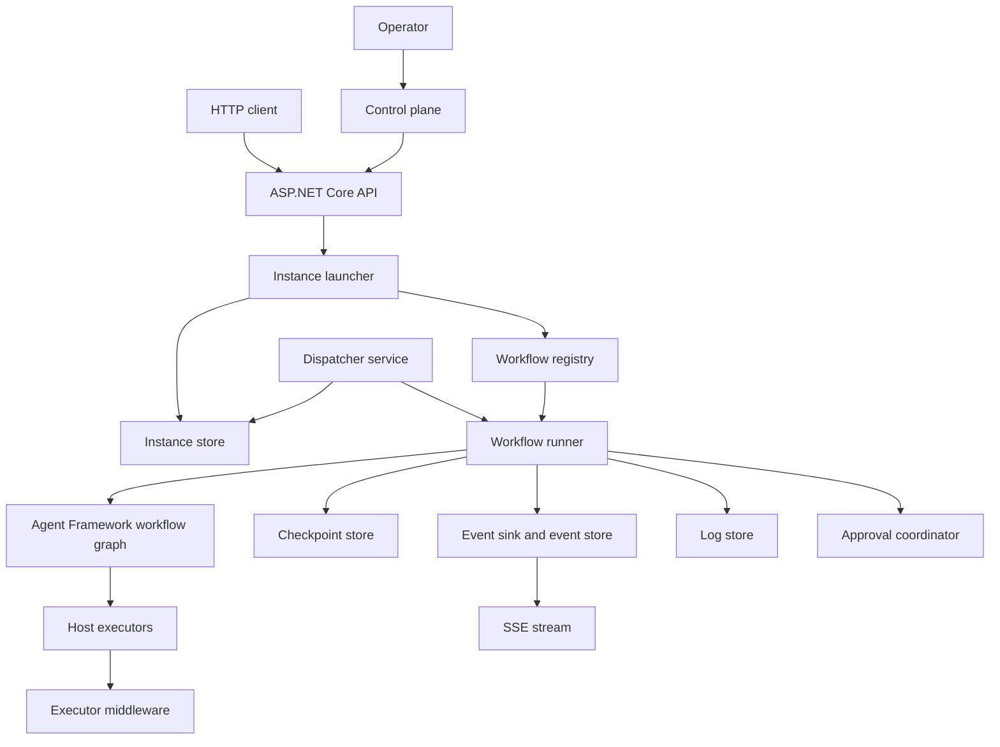
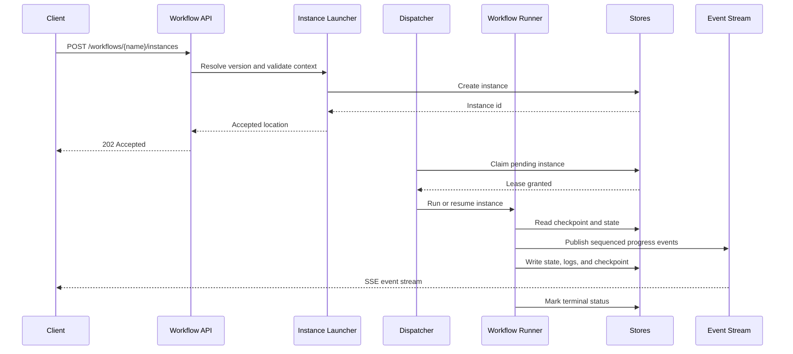
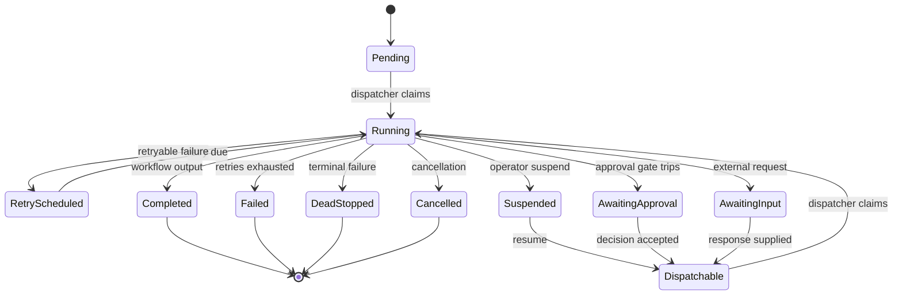
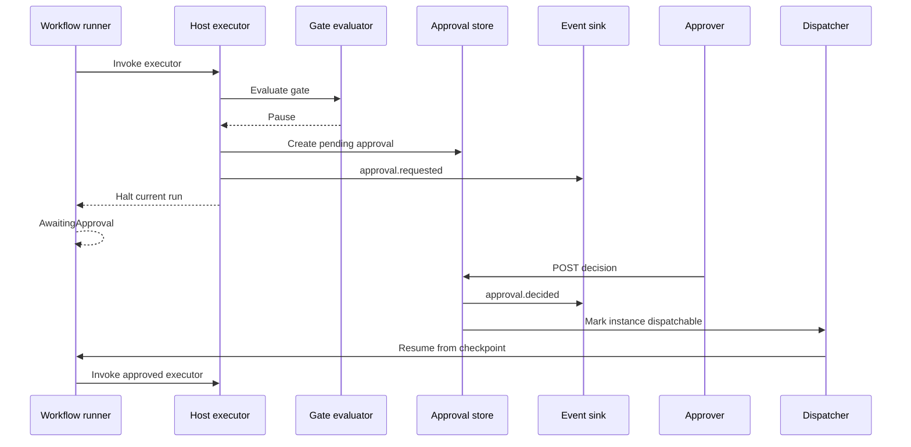
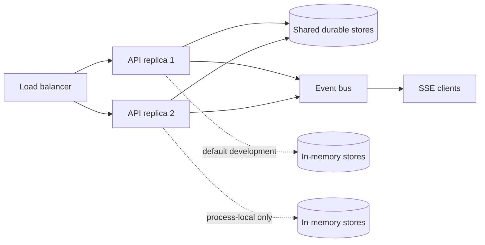
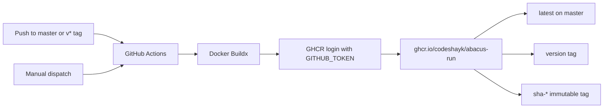

# Abacus Run Wiki

Abacus Run is a .NET 9 workflow runtime and HTTP host built on Microsoft Agent Framework workflows. It turns a graph-based workflow definition into a managed workflow instance with a lifecycle, ownership, retries, checkpoints, approvals, events, logs, and operator controls.

This page is the repository-level technical wiki. It documents the implementation in this repository. The product and technical design documents in this directory describe the broader target architecture; where the target and current implementation differ, this page calls out the difference.

## Contents

- [At a glance](#at-a-glance)
- [Current implementation status](#current-implementation-status)
- [Architecture](#architecture)
- [Project structure](#project-structure)
- [Getting started](#getting-started)
- [Authoring a workflow](#authoring-a-workflow)
- [Registering workflows and middleware](#registering-workflows-and-middleware)
- [Instance lifecycle](#instance-lifecycle)
- [Retries and failure classification](#retries-and-failure-classification)
- [Checkpoints and resumption](#checkpoints-and-resumption)
- [Human approval gates](#human-approval-gates)
- [Events, history, and SSE](#events-history-and-sse)
- [HTTP API](#http-api)
- [Configuration](#configuration)
- [Security and data handling](#security-and-data-handling)
- [Operations](#operations)
- [Containers and GHCR](#containers-and-ghcr)
- [Testing](#testing)
- [Extension points](#extension-points)
- [Design constraints](#design-constraints)
- [Troubleshooting](#troubleshooting)
- [Related documents](#related-documents)

## At a glance

| Concern | Current behavior |
| --- | --- |
| Runtime | .NET 9 / ASP.NET Core minimal API |
| Workflow engine | `Microsoft.Agents.AI.Workflows` |
| Workflow registration | Dependency injection through `AddWorkflow<T>()` or `AddWorkflow(IWorkflowDefinition)` |
| Persistence | In-memory stores by default |
| Checkpoint cadence | Superstep by default; `None`, `SuperStep`, and `Manual` are supported |
| Ownership | Dispatcher and lease abstractions are used by the host; the default stores are process-local |
| Events | Sequenced per-instance event store plus optional event bus and SSE relay |
| Approvals | Durable approval contracts and in-memory coordinator/store, with decision and expiry handling |
| Middleware | Workflow-level and host-executor-level pipelines |
| Library | `src/Abacus.Run` — headless framework: runtime, dispatch, executors, middleware, in-memory stores, HTTP API |
| Service host | `src/Abacus.Run.Service` — control-plane UI, SQL Server stores, Redis event bus, startup wiring |
| Container | Multi-stage .NET 9 image listening on port 8080 |
| Image publishing | GitHub Actions publishes `ghcr.io/codeshayk/abacus-run` |

## Current implementation status

The repository contains a working runtime, API host, control plane, built-in executors, middleware, persistence abstractions, and test suites. The default host wiring in `Program.cs` uses in-memory infrastructure:

- `InMemoryInstanceStore`
- `InMemoryEventStore`
- `InMemoryLogStore`
- `InMemoryApprovalStore`
- `InMemoryGatePolicyStore`
- `InMemoryAuditStore`
- `InMemoryBlobStore`
- `OverflowCheckpointStore` over the blob abstraction
- `InMemoryEventBus`

The store interfaces are the substitution boundary for durable infrastructure. A production deployment must provide shared, durable implementations before relying on process loss recovery or multiple replicas.

The repository also contains `docs/PRD-Abacus-Run.md` and `docs/TDD-Abacus-Run.md`. Those documents describe the intended multi-replica SQL/blob/event-bus architecture and include design decisions that go beyond the current in-memory default.

## Architecture



### Request path

1. A caller posts a typed JSON context to `/workflows/{name}/instances`.
2. The launcher resolves the requested workflow version and validates the context against its CLR type.
3. The launcher creates an instance record and returns `202 Accepted` with the instance location.
4. The dispatcher claims a claimable instance and invokes `WorkflowRunner`.
5. The runner rebuilds the workflow graph from the pinned workflow definition and starts or resumes an Agent Framework streaming run.
6. Framework events are translated into sequenced `EventEnvelope` records.
7. The runner updates instance state, checkpoints, logs, approvals, and terminal outcome as the run progresses.
8. Clients poll the instance, read event history, or subscribe to its SSE stream.

### Start and execution sequence



### Ownership model

An instance is the unit of execution and is identified by a stable `InstanceId`. Its workflow name and version are recorded when it is created. A dispatcher should execute only instances it has successfully claimed. The instance store and lease implementation are responsible for preventing two host replicas from actively driving the same instance.

The default in-memory stores are suitable for development and tests. They do not provide cross-process coordination or durable recovery by themselves.

## Project structure

| Project | Responsibility |
| --- | --- |
| `src/Abacus.Run` | Headless framework: workflow contracts, runtime, dispatch, executors, middleware, in-memory store defaults, and the HTTP API endpoints |
| `src/Abacus.Run.Service` | Deployable host: control-plane UI, SQL Server persistence, Redis event bus, and service registration |
| `tests/Abacus.Run.UnitTests` | Focused runtime and store tests; references the library only |
| `tests/Abacus.Run.IntegrationTests` | Real host, HTTP endpoint, control-plane, and architecture-boundary tests |
| `tests/Abacus.Run.ChaosTests` | Failure and lifecycle resilience tests |
| `tests/Abacus.Run.LoadTests` | Load-oriented test project |

Folders inside each project:

```
src/Abacus.Run/               src/Abacus.Run.Service/
  Abstractions/                 ControlPlane/      Razor Pages backing services
  Api/                          Infrastructure/    SQL Server stores, Redis bus
  Core/                         Pages/             control-plane Razor Pages
  Dispatch/                     wwwroot/           control-plane CSS and JS
  EventBus/                     Program.cs
  Executors/                    AbacusServiceCollectionExtensions.cs
  Middlewares/
  Persistence/
```

### Where the line falls

The library is headless. It serves the API and nothing else, so it takes no dependency on Razor,
MVC, Entity Framework, or Redis, and a consumer that references it gets a working host without
inheriting a UI or a storage choice. The service supplies what is specific to one deployment: the
operator UI, the concrete stores and bus, and the startup code that selects them.

`AddAbacus` reads as two steps for this reason — register the framework with its in-memory defaults,
then displace those defaults when a connection string is configured. With neither
`Abacus:SqlServer:ConnectionString` nor `Abacus:Redis:ConnectionString` set, the host runs entirely
in memory, which is what keeps local development and the integration suite free of external
dependencies.

`ArchitectureBoundaryTests` in the integration suite enforces the split: the library must not
reference the host, EF Core, Redis, or Razor Pages; every framework contract the host implements must
be a named `SqlServer*` or `Redis*` adapter; and the host must define no workflow definitions,
executors, or middleware of its own.

Workflow authors should normally depend on `Abacus.Run` and its `Abacus.Run.Abstractions` namespace,
then register their definitions in the application host.

## Getting started

### Prerequisites

- .NET 9 SDK
- Access to the package feeds configured in `nuget.config`
- Docker Desktop for container work

### Build and test

```bash
dotnet restore Abacus.Run.slnx
dotnet build Abacus.Run.slnx
dotnet test Abacus.Run.slnx
```

For the CI-equivalent Release coverage run:

```bash
dotnet build --configuration Release
dotnet test --configuration Release --no-build --collect:"XPlat Code Coverage"
```

### Run the API host

```bash
dotnet run --project src/Abacus.Run.Service/Abacus.Run.Service.csproj
```

The host exposes:

```bash
curl http://localhost:5000/health/live
curl http://localhost:5000/health/ready
```

The actual port can be changed with standard ASP.NET Core configuration, for example `ASPNETCORE_HTTP_PORTS=8080`.

## Authoring a workflow

A workflow definition supplies a stable name, a semantic version, a typed context/result contract, and a method that builds an Agent Framework workflow graph.

The generic contract is:

```csharp
public interface IWorkflowDefinition<TContext, TResult> : IWorkflowDefinition
    where TContext : notnull
{
    string Name { get; }
    string Version { get; }

    ValueTask<Workflow> BuildAsync(
        WorkflowBuildContext context,
        CancellationToken cancellationToken);

    FailureDisposition Classify(WorkflowFailure failure);
}
```

A minimal definition looks like this:

```csharp
using Abacus.Run.Abstractions;
using Microsoft.Agents.AI.Workflows;

public sealed record GreetingContext(string Name);
public sealed record GreetingResult(string Message);

public sealed class GreetingWorkflow : IWorkflowDefinition<GreetingContext, GreetingResult>
{
    public string Name => "greeting";
    public string Version => "1.0.0";

    public ValueTask<Workflow> BuildAsync(
        WorkflowBuildContext context,
        CancellationToken cancellationToken)
    {
        var executor = context.Node(new GreetingExecutor("greet"));

        Workflow workflow = new WorkflowBuilder(executor)
            .WithName(Name)
            .WithOutputFrom(executor)
            .Build();

        return ValueTask.FromResult(workflow);
    }

    public FailureDisposition Classify(WorkflowFailure failure)
        => DefaultFailureClassifier.Instance.Classify(failure);
}
```

The exact graph construction methods depend on the Agent Framework graph shape. Common operations include adding edges, fan-out/fan-in barriers, conditions, and workflow output bindings.

### Host executors

Host executors derive from `HostExecutor<TIn, TOut>`. They implement `ExecuteCoreAsync`; the sealed `HandleAsync` method owns gate evaluation and the executor middleware pipeline.

```csharp
public sealed class GreetingExecutor : HostExecutor<GreetingContext, GreetingResult>
{
    public GreetingExecutor(string id) : base(id) { }

    protected override ValueTask<GreetingResult> ExecuteCoreAsync(
        GreetingContext input,
        IWorkflowContext context,
        CancellationToken cancellationToken)
        => ValueTask.FromResult(new GreetingResult($"Hello, {input.Name}!"));
}
```

The output type must be a reference type because a gated executor returns `null` while it parks the workflow.

### Raw framework nodes

`WorkflowBuildContext.RawNode(...)` is an escape hatch for raw framework executor bindings and agent bindings. Raw nodes participate in the graph but do not receive host executor middleware and cannot be approval-gated. Use `Node(...)` with a `HostExecutor<TIn, TOut>` when middleware or approvals are required.

## Registering workflows and middleware

The API host uses a fluent registration builder:

```csharp
builder.Services
  .AddAbacus(builder.Configuration)
    .AddWorkflow<GreetingWorkflow>()
  .AddWorkflowMiddleware<CustomWorkflowMiddleware>()
  .AddExecutorMiddleware<CustomExecutorMiddleware>();
```

A prebuilt definition instance can also be registered:

```csharp
builder.Services
  .AddAbacus(builder.Configuration)
    .AddWorkflow(new GreetingWorkflow());
```

`AddAbacus(...)` registers the workflow host, built-in middleware, background services, control-plane UI, and the default in-memory stores. Set `Abacus:SqlServer:ConnectionString` to replace the in-memory stores with EF Core SQL Server implementations, and set `Abacus:Redis:ConnectionString` to enable Redis Streams and cross-replica control messages.

### Middleware ordering

Both middleware interfaces expose an `Order` property. Lower values run earlier in the outer pipeline. Workflow middleware wraps an entire run; executor middleware wraps a single host executor invocation.

```csharp
public sealed class CustomExecutorMiddleware : IExecutorMiddleware
{
    public int Order => 100;

    public bool AppliesTo(ExecutorDescriptor descriptor)
        => descriptor.ExecutorId.StartsWith("payment-", StringComparison.Ordinal);

    public async ValueTask InvokeAsync(
        ExecutorInvocationContext context,
        ExecutorDelegate next,
        CancellationToken cancellationToken)
    {
        await next(context, cancellationToken);
        // Inspect or transform context.Output and context.Exception here.
    }
}
```

Middleware can use `ExecutorInvocationContext.Items` and the shared `MiddlewareContextKeys` values for per-invocation data such as outbound call capture, LLM usage, and prompt version.

## Instance lifecycle

The control-plane status is a superset of the Agent Framework run status.

| Status | Meaning | Claimable | Terminal |
| --- | --- | --- | --- |
| `Pending` | Accepted but not yet claimed | Yes | No |
| `Running` | Actively executing | No | No |
| `AwaitingInput` | Waiting for an external workflow request | No | No |
| `AwaitingApproval` | Waiting for an approval decision | No | No |
| `Suspended` | Parked until explicitly resumed | No | No |
| `RetryScheduled` | Retryable failure is waiting for its next time | Yes | No |
| `Dispatchable` | Explicitly woken and ready to claim | Yes | No |
| `Completed` | Finished with a result | No | Yes |
| `Failed` | Failed after retry handling | No | Yes |
| `DeadStopped` | Business or policy failure is terminal | No | Yes |
| `Cancelled` | Cancellation completed | No | Yes |

A normal run follows this shape:

```text
Pending -> Running -> Completed
                   -> AwaitingApproval -> Dispatchable -> Running
                   -> AwaitingInput
                   -> RetryScheduled -> Running
                   -> Suspended -> Dispatchable -> Running
                   -> Failed / DeadStopped / Cancelled
```



Instances pin the workflow version used at creation. New starts resolve the highest registered version unless the caller supplies `?version=`. A resume attempts to resolve the exact pinned version; if it is unavailable, the instance is dead-stopped with `WorkflowVersionUnavailable`.

## Retries and failure classification

The workflow owns failure classification through `Classify(WorkflowFailure)`. The host applies the result after the engine reports an executor or workflow failure.

| Disposition | Host behavior |
| --- | --- |
| `Retry` | Schedule a retry with exponential backoff and configured jitter, unless attempts or lifetime are exhausted |
| `DeadStop` | Mark the instance `DeadStopped` and record the terminal reason |
| `Escalate` | Move the instance to `AwaitingInput` for external handling |

The default classifier treats transient transport, timeout, rate-limit, and server errors as retryable and validation, approval rejection, and ordinary client errors as terminal. A workflow can override this policy for business-specific cases such as duplicate payments.

Default retry settings:

- Maximum attempts: `5`
- Backoff base: `2` seconds
- Backoff cap: `300` seconds
- Jitter: `Full`
- Maximum lifetime: `24` hours

Retries must be designed for at-least-once execution. Side-effecting executors should use idempotency keys or an application-level deduplication strategy.

## Checkpoints and resumption

The host uses `ICheckpointStore<JsonElement>` through `CheckpointManager.CreateJson(...)`. The default cadence is `SuperStep`, which records a checkpoint after each completed superstep. Other modes are:

- `None`: no checkpoints; the workflow is not resumable from a process-loss point.
- `SuperStep`: checkpoint each superstep.
- `Manual`: the workflow chooses checkpoint boundaries through the framework context.

The overflow checkpoint store keeps small payloads inline and sends larger payloads through the blob store abstraction. The default inline threshold is 256 KiB.

Resumption rebuilds the workflow graph from the pinned definition and calls the framework resume path with the latest checkpoint. A crash after an external side effect but before checkpoint commit can cause that executor to run again. This is intentional at-least-once behavior, not exactly-once execution.

## Human approval gates

Approval gates are declared beside the executor binding:

```csharp
var payment = context.Node(
    new PaymentExecutor("submit-payment"),
    gate => gate
        .Mode(ExecutionMode.Conditional)
        .When<PaymentRequest>(request => request.Amount > 25_000m)
        .Reason("Payment exceeds approval threshold")
        .AssignTo("group:finance")
        .RequireApprovers(2)
        .ExpiresAfter(TimeSpan.FromHours(8))
        .OnExpiry(ExpiryAction.DeadStop)
        .AllowModification());
```

Gate modes:

- `Autonomous`: always proceed.
- `RequireApproval`: always create an approval before execution.
- `Conditional`: evaluate the configured predicate; only a tripped predicate pauses the executor.

When a gate trips:

1. The approval request is persisted.
2. An `approval.requested` event is emitted into the same instance event sequence as progress.
3. The executor does not run and the instance transitions to `AwaitingApproval`.
4. An authorized decision changes the approval state and wakes the instance.
5. The instance resumes from its checkpoint and the approved executor can run.



Decision outcomes are `Approve`, `Reject`, and `ApproveWithModification`. Modification is accepted only when `AllowModification` is enabled. Multiple approvers are supported through `RequireApprovers(...)`; the decision is accepted when quorum is reached.

Expiry actions are `DeadStop`, `Reject`, `AutoApprove`, and `Escalate`. Approval decisions enforce assignees, quorum, and optional segregation of duties.

## Events, history, and SSE

Every instance event has a monotonically increasing per-instance `Sequence`. The same sequence is used as the SSE event ID, which lets clients reconnect with `Last-Event-ID` and request replay from the same cursor.

Important event types include:

- `workflow.started`
- `executor.invoked`
- `executor.completed`
- `executor.failed`
- `superstep.completed`
- `approval.requested`
- `approval.decided`
- `approval.expired`
- `request.pending`
- `workflow.output`
- `workflow.terminated`
- `instance.cancelled`
- `instance.rerun_requested`
- `instance.suspended`
- `instance.resumed`
- `heartbeat`

Use event history for polling, audit views, and recovery. Use SSE for live progress. Approval events use the same event stream as workflow progress; consumers do not need a separate subscription to observe a gate trip.

## HTTP API

The API is implemented in `src/Abacus.Run/Api/Endpoints.cs`. Error responses use ASP.NET Core problem details and validation problem details where applicable.

### Health

| Method | Path | Purpose |
| --- | --- | --- |
| `GET` | `/health/live` | Process liveness |
| `GET` | `/health/ready` | Host readiness |

### Workflow catalog and start

| Method | Path | Purpose |
| --- | --- | --- |
| `GET` | `/workflows` | List registered workflow names and versions |
| `GET` | `/workflows/{name}` | List versions for one workflow |
| `POST` | `/workflows/{name}/instances` | Create a workflow instance |

A start request body contains a workflow-specific context object. Optional request controls include:

- `version` query parameter for an exact workflow version.
- `Idempotency-Key` header to replay a prior start without creating a second instance.
- `Prefer: wait=<seconds>` header to wait for a terminal result, capped by the host.
- Tenant and correlation values supplied through the host's request metadata conventions.

A successful asynchronous start returns `202 Accepted` and a location such as `/instances/{id}`. Unknown workflows return `404`; invalid context returns `400` with field errors.

### Instances and diagnostics

| Method | Path | Purpose |
| --- | --- | --- |
| `GET` | `/instances/{id}` | Retrieve instance state |
| `GET` | `/instances` | Query instances by status, workflow, correlation ID, limit, and offset |
| `GET` | `/instances/{id}/graph` | Retrieve the workflow graph representation |
| `GET` | `/instances/{id}/logs` | Query instance logs |
| `GET` | `/instances/{id}/checkpoints` | Inspect checkpoint metadata |
| `GET` | `/instances/{id}/events/history` | Read persisted event history |
| `GET` | `/instances/{id}/events` | Subscribe to live SSE events |

### Instance controls

| Method | Path | Purpose |
| --- | --- | --- |
| `POST` | `/instances/{id}/cancel` | Request cancellation |
| `POST` | `/instances/{id}/retry` | Force a retry of a retryable/failed instance |
| `POST` | `/instances/{id}/rerun` | Create a new run based on an existing instance |
| `POST` | `/instances/{id}/suspend` | Park an instance |
| `POST` | `/instances/{id}/resume` | Wake a suspended or waiting instance |

Control operations are instance-state dependent. The API returns conflict responses when an operation cannot be applied to the current state.

### Approvals

| Method | Path | Purpose |
| --- | --- | --- |
| `GET` | `/approvals` | Query approvals |
| `GET` | `/approvals/{approvalId}` | Retrieve one approval |
| `GET` | `/instances/{id}/approvals` | List approvals for an instance |
| `POST` | `/approvals/{approvalId}/decision` | Submit an approval decision |

## Configuration

Configuration is bound from the `WorkflowHost` section. Defaults are defined in `WorkflowHostOptions`.

```json
{
  "WorkflowHost": {
    "ReplicaId": "api-1",
    "MaxConcurrentInstances": 100,
    "ClaimBatchSize": 10,
    "PerWorkflowConcurrency": {
      "payments": 10
    },
    "Lease": {
      "DurationSeconds": 60,
      "RenewalSeconds": 20
    },
    "Drain": {
      "GraceSeconds": 45
    },
    "Checkpoint": {
      "Cadence": "SuperStep",
      "InlineThresholdBytes": 262144
    },
    "Retry": {
      "MaxAttempts": 5,
      "BackoffBaseSeconds": 2,
      "BackoffCapSeconds": 300,
      "Jitter": "Full",
      "MaxLifetimeHours": 24
    },
    "Approvals": {
      "DefaultExpiryHours": 24,
      "SweepIntervalSeconds": 30,
      "PolicyCacheSeconds": 30
    },
    "Events": {
      "BatchSize": 200,
      "ChannelCapacity": 10000,
      "RetentionDays": 90
    },
    "Sse": {
      "HeartbeatSeconds": 15,
      "MaxSubscribersPerInstance": 50
    },
    "Retention": {
      "InstanceDays": 90,
      "CheckpointDays": 7,
      "AuditDays": 365
    },
    "Logging": {
      "BodySampleRate": 0.1,
      "MaxBodyBytes": 32768,
      "BodyFieldAllowList": []
    },
    "Drift": {
      "BaselineWindowDays": 7,
      "MinSamples": 200,
      "EmbeddingSampleRate": 0.05,
      "SustainedWindowMinutes": 15,
      "SigmaThreshold": 3.0
    },
    "Egress": {
      "Enforce": true,
      "AllowedHosts": ["api.example.com"]
    }
  }
}
```

### Important production settings

- Set a stable `ReplicaId` when running multiple hosts.
- Match lease duration and renewal intervals to expected executor latency.
- Keep checkpoints shorter-lived than terminal instance records unless audit requirements say otherwise.
- Set an explicit egress allowlist for outbound API executors.
- Keep `Egress.Enforce` enabled outside local development.
- Add only safe fields to `Logging.BodyFieldAllowList`.
- Preserve the default header deny list for authorization and cookie material.
- Size event channel capacity and SSE subscriber limits for expected fan-out.

## Security and data handling

### Egress protection

`EgressGuard` rejects non-HTTP(S) schemes, relative URLs, internal address literals, and hosts outside the configured allowlist. It also blocks loopback, private, link-local, metadata, and other internal address ranges. Wildcard allowlist entries such as `*.example.com` match subdomains but not the bare domain.

Keep the guard enabled for API and LLM executors. Disabling enforcement is intended only for controlled local development.

### Redaction and logging

The built-in request/response logging middleware samples bodies and applies an allowlist. Sensitive headers such as `Authorization`, `Cookie`, `Set-Cookie`, `x-api-key`, and `Proxy-Authorization` are denied by default. Treat context, result, approval input, and logs as sensitive data in a real deployment.

### Tenancy and authorization

Instances and approvals carry a tenant identifier. The API and store implementations must enforce tenant isolation at the request boundary and persistence boundary. The in-memory reference stores model the contract but are not a replacement for a production identity and authorization system.

### Secrets

Do not put API keys or connection strings in workflow context payloads, Docker layers, or repository files. Use the deployment platform's secret/configuration mechanism and inject services into executors through `WorkflowBuildContext.Services` when needed.

## Operations

### Readiness and liveness

Use `/health/live` for process liveness and `/health/ready` for routing traffic only when the host is ready to accept work. Configure the container or orchestrator to probe port 8080.

### Deployment shape



The shared-store branch is the production target. The in-memory branch is useful for local development but cannot coordinate independent processes.

### Graceful drain

The dispatch layer has a drain service. During shutdown it stops new lease claims, waits for active instances up to the configured grace period, and then completes shutdown. Configure `Drain.GraceSeconds` to cover normal in-flight work without making deployments unnecessarily slow.

### Observability

Built-in middleware provides:

- OpenTelemetry workflow and executor instrumentation.
- Request/response logging with body sampling and redaction.
- LLM drift monitoring through a baseline store and alert sink.

Use instance events for business progress and state transitions; use logs and traces for diagnostic detail. The event sequence is the durable consumer cursor, not a replacement for metrics.

### Retention

The options distinguish instance, checkpoint, event, and audit retention. With in-memory stores, retention is process-local. Durable implementations should enforce the same policy with scheduled cleanup jobs and should preserve enough event history for operational replay and audit requirements.

## Containers and GHCR

The root `Dockerfile` is a multi-stage build:

1. Restore and publish `src/Abacus.Run.Service/Abacus.Run.Service.csproj` with the .NET 9 SDK image.
2. Copy the publish output into the .NET 9 ASP.NET runtime image.
3. Listen on port 8080 and run `Abacus.Run.Service.dll`.

Build and run locally:

```bash
docker build -t abacus-run:local .
docker run --rm -p 8080:8080 abacus-run:local
curl http://localhost:8080/health/live
```

The workflow `.github/workflows/container.yml` publishes to:

```text
ghcr.io/codeshayk/abacus-run
```

It authenticates with the workflow `GITHUB_TOKEN` and requires `packages: write`. It runs on pushes to `master`, `v*` tags, and manual dispatch. Tags include `latest` on `master`, the Git tag on version-tag pushes, and an immutable `sha-...` tag.



To pull the latest main image:

```bash
docker pull ghcr.io/codeshayk/abacus-run:latest
docker run --rm -p 8080:8080 ghcr.io/codeshayk/abacus-run:latest
```

The package visibility and first-publish behavior are governed by GitHub repository/package settings. A repository administrator may need to make the package public or grant access to consumers after the first publish.

## Testing

The solution includes several test layers:

| Suite | Purpose |
| --- | --- |
| Unit tests | Contracts, policies, runner behavior, middleware, executors, stores, and control logic |
| Integration tests | Real ASP.NET Core host, HTTP routes, event streams, approvals, and instance controls |
| Chaos tests | Failure and lifecycle scenarios |
| Load tests | Throughput-oriented test project |

Common commands:

```bash
# All tests
dotnet test Abacus.Run.slnx

# Release test run with coverage
dotnet test --configuration Release --no-build --collect:"XPlat Code Coverage"

# One project
dotnet test tests/Abacus.Run.UnitTests/Abacus.Run.UnitTests.csproj

# One test by name
dotnet test tests/Abacus.Run.UnitTests/Abacus.Run.UnitTests.csproj \
  --filter "FullyQualifiedName~WorkflowRunnerTests"
```

Build before using `--no-build`:

```bash
dotnet build --configuration Release
dotnet test --configuration Release --no-build
```

## Extension points

### Custom persistence

Implement the store interfaces used by `AddWorkflowHost`, including instance, event, log, approval, gate policy, audit, blob, and checkpoint contracts. Preserve these invariants:

- Instance updates use optimistic concurrency.
- Terminal state is not overwritten by a losing writer.
- Lease ownership is exclusive and renewable.
- Event sequence values are unique and ordered per instance.
- Checkpoint indexes are returned in the order expected by `CheckpointManager`.
- Approval decisions are single-winner and quorum-aware.

### Custom executors

Derive from `HostExecutor<TIn, TOut>` and implement `ExecuteCoreAsync`. Keep side effects idempotent and expose useful metadata through the executor descriptor. Do not bypass `HandleAsync`.

### Custom middleware

Implement `IWorkflowMiddleware` for run-wide behavior or `IExecutorMiddleware` for node-level behavior. Use `AppliesTo` to limit scope and avoid putting transport-specific behavior into workflow definitions.

### Custom approval policies

Provide an `IGatePolicyStore` implementation when approval requirements depend on tenant, workflow, executor, amount, role, or environment. Keep policy evaluation deterministic and observable.

### Custom event sinks and buses

The runner publishes through `IEventSink`. A sink may persist the event, relay it to an event bus, or do both. Preserve the per-instance sequence when forwarding to SSE or external consumers.

## Design constraints

### At-least-once execution

A checkpoint cannot atomically cover every external side effect. An executor may run again after a crash. Use idempotency keys, transactionally recorded effects, or an application-level deduplication table for side-effecting work.

### Host executor middleware boundary

The Agent Framework does not expose a generic interception seam for arbitrary executors. Abacus Run therefore owns the middleware seam in `HostExecutor<TIn, TOut>`. Raw framework executors can be used, but they do not receive host executor middleware or approval gates.

### Pinned workflow versions

Version selection occurs at start. Resumption uses the exact recorded version so a deployed definition cannot silently change the meaning of an in-flight instance.

### Event sequencing

Approval events and progress events share the instance event sequence. This is necessary for one coherent SSE replay cursor and avoids a client observing a progress event without the approval event that caused the instance to park.

### In-memory defaults

The in-memory stores make local development and deterministic tests straightforward. They intentionally do not claim the durability, failover, or cross-replica guarantees of the target production architecture.

## Troubleshooting

### Docker publish fails with a C# preview feature error

Use the repository's .NET 9 SDK image and build from the root. The API project and its project references must be copied into the Docker build context. Preview-only syntax should not be introduced into code compiled by the .NET 9 image.

### `dotnet test --no-build` cannot find a DLL

Build the requested configuration first. Debug binaries do not satisfy a Release `--no-build` run:

```bash
dotnet build --configuration Release
dotnet test --configuration Release --no-build
```

### A workflow is not listed

Confirm the definition is registered with `.AddWorkflow<T>()` or `.AddWorkflow(definition)`, that the host calls `AddWorkflowHost(...)`, and that the application is running the expected build.

### A start request returns validation errors

The context JSON must be present, non-null, and deserializable to the workflow's declared context type. Check property names, required members, and the selected workflow version.

### An instance remains pending

Check that `AddBackgroundServices()` is registered and that the dispatcher is running. In a multi-replica deployment, inspect lease ownership and the shared instance store. With in-memory stores, a second process cannot see the first process's instances.

### An approval does not resume the instance

Inspect the approval state, decision authorization, quorum, expiry, and instance status. A successful decision wakes the instance by moving it to a claimable state; the dispatcher must be running to execute the resumed run.

### An outbound call is blocked

Check the URL scheme, whether the target resolves to an internal address, and whether the hostname matches `WorkflowHost:Egress:AllowedHosts`. Keep `Egress:Enforce=true` unless this is a controlled local test.

## Related documents

- [`README.md`](../README.md) - Short setup and API overview
- [`PRD-Abacus-Run.md`](PRD-Abacus-Run.md) - Product requirements and target architecture
- [`TDD-Abacus-Run.md`](TDD-Abacus-Run.md) - Technical design and framework grounding
- [`Dockerfile`](../Dockerfile) - Container build
- [`container.yml`](../.github/workflows/container.yml) - GHCR publishing workflow
- [`ci.yml`](../.github/workflows/ci.yml) - Build and test workflow
- [`release.yml`](../.github/workflows/release.yml) - Release tagging workflow
